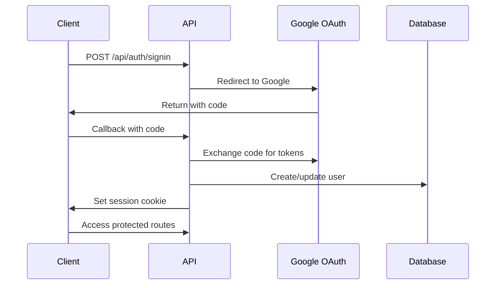

# DINO API Design Specifications

## 🌐 API Architecture Overview

### Design Principles

1. **RESTful Design**: Follow REST conventions with proper HTTP methods
2. **Consistency**: Uniform response structures and error handling
3. **Security First**: Authentication, authorization, and input validation
4. **Performance**: Optimized queries, caching, and pagination
5. **Versioning**: Future-proof API design with version support

### Base URL Structure

```
Production: https://api.dino.travel/v1
Development: http://localhost:3000/api
```

## 🔑 Authentication & Authorization

### Authentication Flow



### Authorization Headers

```http
# Session-based (primary)
Cookie: next-auth.session-token=...

# CSRF Protection
X-CSRF-Token: <csrf-token>
```

## 📚 API Endpoints

### Authentication Endpoints

#### `GET /api/auth/providers`

Get available authentication providers

```json
{
  "google": {
    "id": "google",
    "name": "Google",
    "type": "oauth",
    "signinUrl": "/api/auth/signin/google",
    "callbackUrl": "/api/auth/callback/google"
  }
}
```

#### `GET /api/auth/session`

Get current user session

```json
{
  "user": {
    "id": "clp123...",
    "email": "user@example.com",
    "name": "John Doe",
    "image": "https://...",
    "passportCountry": "US"
  },
  "expires": "2024-02-01T00:00:00.000Z"
}
```

### Trip Management Endpoints

#### `GET /api/trips`

Get user's trips with filtering and pagination

```http
GET /api/trips?country=FR&year=2024&page=1&limit=20
```

Response:

```json
{
  "success": true,
  "data": {
    "trips": [
      {
        "id": "clp123...",
        "country": "France",
        "entryDate": "2024-01-01T00:00:00.000Z",
        "exitDate": "2024-01-10T00:00:00.000Z",
        "visaType": "Tourist",
        "maxDays": 90,
        "passportCountry": "US",
        "notes": "Paris vacation",
        "createdAt": "2024-01-01T00:00:00.000Z",
        "updatedAt": "2024-01-01T00:00:00.000Z"
      }
    ],
    "pagination": {
      "page": 1,
      "limit": 20,
      "total": 45,
      "totalPages": 3
    }
  }
}
```

#### `POST /api/trips`

Create a new trip

```json
{
  "country": "France",
  "entryDate": "2024-01-01",
  "exitDate": "2024-01-10",
  "visaType": "Tourist",
  "maxDays": 90,
  "passportCountry": "US",
  "notes": "Paris vacation"
}
```

Response:

```json
{
  "success": true,
  "data": {
    "trip": {
      "id": "clp123...",
      "country": "France",
      "entryDate": "2024-01-01T00:00:00.000Z",
      "exitDate": "2024-01-10T00:00:00.000Z",
      "visaType": "Tourist",
      "maxDays": 90,
      "passportCountry": "US",
      "notes": "Paris vacation",
      "createdAt": "2024-01-01T00:00:00.000Z",
      "updatedAt": "2024-01-01T00:00:00.000Z"
    }
  },
  "message": "Trip created successfully"
}
```

#### `GET /api/trips/:id`

Get a specific trip

```json
{
  "success": true,
  "data": {
    "trip": {
      "id": "clp123...",
      "country": "France",
      "entryDate": "2024-01-01T00:00:00.000Z",
      "exitDate": "2024-01-10T00:00:00.000Z",
      "visaType": "Tourist",
      "maxDays": 90,
      "passportCountry": "US",
      "notes": "Paris vacation",
      "createdAt": "2024-01-01T00:00:00.000Z",
      "updatedAt": "2024-01-01T00:00:00.000Z"
    }
  }
}
```

#### `PUT /api/trips/:id`

Update a trip

```json
{
  "exitDate": "2024-01-15",
  "notes": "Extended stay in Paris"
}
```

#### `DELETE /api/trips/:id`

Delete a trip

```json
{
  "success": true,
  "message": "Trip deleted successfully"
}
```

### Schengen Calculator Endpoints

#### `GET /api/schengen`

Calculate current Schengen status

```json
{
  "success": true,
  "data": {
    "status": {
      "daysUsed": 45,
      "daysRemaining": 45,
      "earliestExitDate": "2024-03-15T00:00:00.000Z",
      "nextAvailableEntry": "2024-07-01T00:00:00.000Z",
      "currentlyInSchengen": false,
      "periodStart": "2023-09-17T00:00:00.000Z",
      "periodEnd": "2024-03-15T00:00:00.000Z"
    },
    "warnings": [
      {
        "type": "APPROACHING_LIMIT",
        "message": "You have used 45 out of 90 days",
        "severity": "warning",
        "daysRemaining": 45
      }
    ],
    "trips": [
      {
        "country": "France",
        "entryDate": "2024-01-01T00:00:00.000Z",
        "exitDate": "2024-01-10T00:00:00.000Z",
        "daysInSchengen": 10
      }
    ]
  }
}
```

#### `POST /api/schengen/simulate`

Simulate a future trip

```json
{
  "country": "Germany",
  "entryDate": "2024-06-01",
  "exitDate": "2024-06-30"
}
```

Response:

```json
{
  "success": true,
  "data": {
    "simulation": {
      "allowed": true,
      "daysAvailable": 45,
      "wouldUse": 30,
      "remainingAfter": 15,
      "warnings": []
    }
  }
}
```

### Google Calendar Integration

#### `GET /api/calendar/calendars`

Get user's Google calendars

```json
{
  "success": true,
  "data": {
    "calendars": [
      {
        "id": "primary",
        "summary": "Personal Calendar",
        "primary": true,
        "accessRole": "owner"
      },
      {
        "id": "travel@...",
        "summary": "Travel Calendar",
        "primary": false,
        "accessRole": "owner"
      }
    ]
  }
}
```

#### `POST /api/calendar/sync`

Sync trips with Google Calendar

```json
{
  "calendarId": "primary",
  "syncDirection": "both",
  "dateRange": {
    "start": "2024-01-01",
    "end": "2024-12-31"
  }
}
```

Response:

```json
{
  "success": true,
  "data": {
    "synced": {
      "imported": 5,
      "exported": 3,
      "updated": 2,
      "skipped": 1
    },
    "errors": []
  }
}
```

### Statistics & Analytics

#### `GET /api/stats`

Get user statistics

```json
{
  "success": true,
  "data": {
    "stats": {
      "totalTrips": 45,
      "countriesVisited": 23,
      "totalDaysAbroad": 365,
      "currentYear": {
        "trips": 12,
        "countries": 8,
        "days": 120
      },
      "schengenUsage": {
        "current": 45,
        "average": 60,
        "peak": 89
      },
      "favoriteCountries": [
        { "country": "France", "visits": 8 },
        { "country": "Spain", "visits": 6 },
        { "country": "Italy", "visits": 5 }
      ]
    }
  }
}
```

### Data Management

#### `GET /api/export`

Export user data

```http
GET /api/export?format=json
```

Response:

```json
{
  "success": true,
  "data": {
    "export": {
      "version": "1.0",
      "exportDate": "2024-01-01T00:00:00.000Z",
      "user": {
        "email": "user@example.com",
        "passportCountry": "US"
      },
      "trips": [...],
      "settings": {...}
    }
  }
}
```

#### `POST /api/import`

Import user data

```json
{
  "data": {
    "version": "1.0",
    "trips": [...],
    "settings": {...}
  },
  "mode": "merge"
}
```

### Admin Endpoints

#### `GET /api/admin/database`

Database health check (admin only)

```json
{
  "success": true,
  "data": {
    "health": {
      "status": "healthy",
      "connections": {
        "active": 5,
        "idle": 15,
        "total": 20
      },
      "performance": {
        "avgQueryTime": 23,
        "slowQueries": 2
      }
    }
  }
}
```

## 🔒 Security Specifications

### Input Validation

All inputs are validated using Zod schemas:

```typescript
const tripSchema = z.object({
  country: z.string().min(2).max(100),
  entryDate: z.string().refine(isValidDate),
  exitDate: z.string().optional().refine(isValidDate),
  visaType: z.enum(VISA_TYPES),
  maxDays: z.number().min(1).max(365),
  passportCountry: z.enum(PASSPORT_COUNTRIES),
  notes: z.string().max(500).optional(),
});
```

### Rate Limiting

```typescript
// Rate limit configuration
const rateLimits = {
  general: { requests: 100, window: '15m' },
  mutation: { requests: 20, window: '15m' },
  auth: { requests: 5, window: '15m' },
  export: { requests: 10, window: '1h' },
};
```

### CSRF Protection

All mutation endpoints require CSRF token validation:

```typescript
// CSRF validation
const csrfToken = request.headers.get('X-CSRF-Token');
const sessionToken = request.cookies.get('csrf-token');
if (csrfToken !== sessionToken) {
  return createErrorResponse(ErrorCode.CSRF_ERROR);
}
```

## 📊 Error Handling

### Error Response Format

```json
{
  "success": false,
  "error": {
    "error": "Validation failed",
    "code": "VALIDATION_ERROR",
    "details": {
      "country": ["Country is required"],
      "entryDate": ["Invalid date format"]
    },
    "requestId": "req_123456789_abc",
    "timestamp": "2024-01-01T00:00:00.000Z"
  }
}
```

### Error Codes

```typescript
enum ErrorCode {
  // Client errors (4xx)
  BAD_REQUEST = 'BAD_REQUEST',
  UNAUTHORIZED = 'UNAUTHORIZED',
  FORBIDDEN = 'FORBIDDEN',
  NOT_FOUND = 'NOT_FOUND',
  CONFLICT = 'CONFLICT',
  VALIDATION_ERROR = 'VALIDATION_ERROR',
  RATE_LIMIT_ERROR = 'RATE_LIMIT_ERROR',

  // Server errors (5xx)
  INTERNAL_SERVER_ERROR = 'INTERNAL_SERVER_ERROR',
  DATABASE_ERROR = 'DATABASE_ERROR',
  EXTERNAL_SERVICE_ERROR = 'EXTERNAL_SERVICE_ERROR',
}
```

## 🚀 Performance Optimization

### Caching Strategy

```typescript
// Cache headers
const cacheControl = {
  trips: 'private, max-age=300', // 5 minutes
  stats: 'private, max-age=600', // 10 minutes
  schengen: 'private, max-age=60', // 1 minute
  static: 'public, max-age=86400', // 24 hours
};
```

### Pagination

All list endpoints support pagination:

```typescript
interface PaginationParams {
  page?: number; // Default: 1
  limit?: number; // Default: 20, Max: 100
  sort?: string; // Format: field:asc|desc
}
```

### Query Optimization

- Database connection pooling
- Query result caching
- Optimized indexes
- Lazy loading of relations

## 🧪 API Testing

### Integration Test Example

```typescript
describe('POST /api/trips', () => {
  it('creates a new trip', async () => {
    const response = await request(app)
      .post('/api/trips')
      .set('Cookie', authCookie)
      .set('X-CSRF-Token', csrfToken)
      .send({
        country: 'France',
        entryDate: '2024-01-01',
        exitDate: '2024-01-10',
        visaType: 'Tourist',
        maxDays: 90,
        passportCountry: 'US',
      });

    expect(response.status).toBe(201);
    expect(response.body.success).toBe(true);
    expect(response.body.data.trip).toMatchObject({
      country: 'France',
      visaType: 'Tourist',
    });
  });
});
```

## 📝 API Documentation

### OpenAPI Specification

```yaml
openapi: 3.0.0
info:
  title: DINO API
  version: 1.0.0
  description: Digital Nomad Travel Management API

paths:
  /api/trips:
    get:
      summary: Get user trips
      security:
        - cookieAuth: []
      parameters:
        - name: country
          in: query
          schema:
            type: string
        - name: page
          in: query
          schema:
            type: integer
            default: 1
      responses:
        200:
          description: List of trips
          content:
            application/json:
              schema:
                $ref: '#/components/schemas/TripListResponse'
```

---

This API design provides a robust, secure, and scalable foundation for the DINO application, ensuring excellent developer experience and reliable service delivery.
