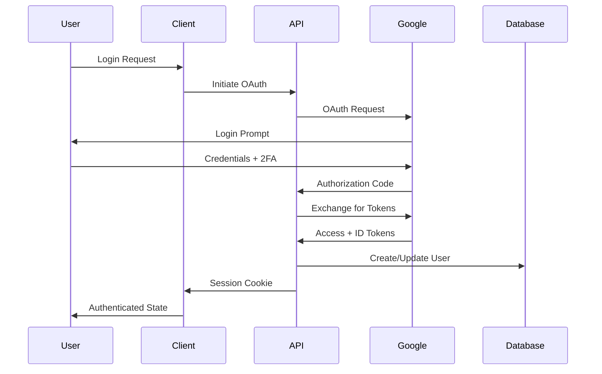

# DINO Security Architecture Design

## 🛡️ Security Overview

### Security Philosophy
**Zero Trust Architecture**: Never trust, always verify. Every request, user, and system component must be authenticated and authorized before accessing resources.

### Security Principles
1. **Defense in Depth**: Multiple layers of security controls
2. **Principle of Least Privilege**: Minimal access rights
3. **Security by Design**: Built-in security from the ground up
4. **Privacy by Default**: Data protection as default behavior
5. **Fail Secure**: System fails to a secure state

## 🔐 Authentication Architecture

### Multi-Factor Authentication Flow


### Authentication Implementation
```typescript
// NextAuth.js configuration
export const authOptions: NextAuthOptions = {
  providers: [
    GoogleProvider({
      clientId: process.env.GOOGLE_CLIENT_ID!,
      clientSecret: process.env.GOOGLE_CLIENT_SECRET!,
      authorization: {
        params: {
          scope: 'openid email profile https://www.googleapis.com/auth/calendar',
          access_type: 'offline',
          prompt: 'consent',
        },
      },
    }),
  ],
  adapter: PrismaAdapter(prisma),
  session: {
    strategy: 'database',
    maxAge: 30 * 24 * 60 * 60, // 30 days
    updateAge: 24 * 60 * 60,   // 24 hours
  },
  cookies: {
    sessionToken: {
      name: 'next-auth.session-token',
      options: {
        httpOnly: true,
        sameSite: 'lax',
        path: '/',
        secure: process.env.NODE_ENV === 'production',
      },
    },
  },
  callbacks: {
    async session({ session, user }) {
      // Add security metadata
      session.user.id = user.id
      session.lastActivity = new Date().toISOString()
      session.ipAddress = await getClientIP()
      return session
    },
    async signIn({ user, account, profile }) {
      // Security checks
      if (account?.provider === 'google') {
        return await verifyGoogleAccount(profile)
      }
      return true
    },
  },
}
```

## 🔒 Authorization System

### Role-Based Access Control (RBAC)
```typescript
enum UserRole {
  USER = 'user',
  ADMIN = 'admin',
  MODERATOR = 'moderator',
}

enum Permission {
  READ_OWN_DATA = 'read:own_data',
  WRITE_OWN_DATA = 'write:own_data',
  READ_ALL_DATA = 'read:all_data',
  WRITE_ALL_DATA = 'write:all_data',
  MANAGE_USERS = 'manage:users',
  SYSTEM_ADMIN = 'system:admin',
}

const rolePermissions: Record<UserRole, Permission[]> = {
  [UserRole.USER]: [
    Permission.READ_OWN_DATA,
    Permission.WRITE_OWN_DATA,
  ],
  [UserRole.MODERATOR]: [
    Permission.READ_OWN_DATA,
    Permission.WRITE_OWN_DATA,
    Permission.READ_ALL_DATA,
  ],
  [UserRole.ADMIN]: [
    Permission.READ_OWN_DATA,
    Permission.WRITE_OWN_DATA,
    Permission.READ_ALL_DATA,
    Permission.WRITE_ALL_DATA,
    Permission.MANAGE_USERS,
    Permission.SYSTEM_ADMIN,
  ],
}
```

### Authorization Middleware
```typescript
export const authorize = (
  requiredPermission: Permission
) => {
  return async (req: NextRequest) => {
    const session = await getServerSession(authOptions)
    
    if (!session?.user) {
      return createErrorResponse(ErrorCode.UNAUTHORIZED)
    }
    
    const userPermissions = rolePermissions[session.user.role]
    
    if (!userPermissions.includes(requiredPermission)) {
      return createErrorResponse(ErrorCode.FORBIDDEN)
    }
    
    return { proceed: true, user: session.user }
  }
}
```

## 🛡️ Input Validation & Sanitization

### Multi-Layer Validation
```typescript
// Layer 1: Zod Schema Validation
const tripSchema = z.object({
  country: z.string()
    .min(2, 'Country must be at least 2 characters')
    .max(100, 'Country too long')
    .regex(/^[a-zA-Z\s-']+$/, 'Invalid country format'),
  entryDate: z.string()
    .refine(isValidDate, 'Invalid date format')
    .refine(isNotFutureDate, 'Date cannot be in the future'),
  notes: z.string()
    .max(500, 'Notes too long')
    .optional()
    .transform(val => val ? sanitizeHtml(val) : val),
})

// Layer 2: DOMPurify Sanitization
export const sanitizeInput = (input: string): string => {
  return DOMPurify.sanitize(input, {
    ALLOWED_TAGS: [],
    ALLOWED_ATTR: [],
    KEEP_CONTENT: true,
  })
}

// Layer 3: Database Parameter Binding (Prisma handles this)
const trip = await prisma.countryVisit.create({
  data: validatedData, // Already validated and sanitized
})
```

### CSRF Protection
```typescript
export const csrfProtection = async (
  request: NextRequest,
  options: { requireDoubleSubmit?: boolean } = {}
) => {
  const session = await getServerSession(authOptions)
  
  if (!session) {
    return { protected: false, response: createErrorResponse(ErrorCode.UNAUTHORIZED) }
  }
  
  // Double Submit Cookie Pattern
  if (options.requireDoubleSubmit) {
    const csrfToken = request.headers.get('X-CSRF-Token')
    const csrfCookie = request.cookies.get('csrf-token')?.value
    
    if (!csrfToken || !csrfCookie || csrfToken !== csrfCookie) {
      return { 
        protected: false, 
        response: createErrorResponse(ErrorCode.CSRF_ERROR)
      }
    }
  }
  
  // SameSite Cookie Protection (primary defense)
  const sessionCookie = request.cookies.get('next-auth.session-token')
  if (!sessionCookie) {
    return { protected: false, response: createErrorResponse(ErrorCode.UNAUTHORIZED) }
  }
  
  return { protected: true }
}
```

## 🚦 Rate Limiting

### Adaptive Rate Limiting
```typescript
interface RateLimitConfig {
  requests: number
  window: string
  skipSuccessfulRequests?: boolean
  skipFailedRequests?: boolean
  keyGenerator?: (req: NextRequest) => string
}

const rateLimitConfigs: Record<string, RateLimitConfig> = {
  auth: {
    requests: 5,
    window: '15m',
    skipSuccessfulRequests: false,
    keyGenerator: (req) => getClientIP(req),
  },
  api: {
    requests: 100,
    window: '15m',
    skipSuccessfulRequests: true,
    keyGenerator: (req) => getUserId(req) || getClientIP(req),
  },
  mutation: {
    requests: 20,
    window: '15m',
    skipSuccessfulRequests: true,
  },
  export: {
    requests: 5,
    window: '1h',
    skipSuccessfulRequests: false,
  },
}

export const applyRateLimit = async (
  request: NextRequest,
  type: keyof typeof rateLimitConfigs
) => {
  const config = rateLimitConfigs[type]
  const key = config.keyGenerator?.(request) || getUserId(request) || getClientIP(request)
  
  const { success, limit, remaining, reset } = await checkRateLimit(key, config)
  
  if (!success) {
    return NextResponse.json(
      { error: 'Rate limit exceeded' },
      { 
        status: 429,
        headers: {
          'X-RateLimit-Limit': limit.toString(),
          'X-RateLimit-Remaining': remaining.toString(),
          'X-RateLimit-Reset': reset.toString(),
          'Retry-After': ((reset - Date.now()) / 1000).toString(),
        },
      }
    )
  }
  
  return null // No rate limit triggered
}
```

## 🔐 Data Protection

### Encryption Strategy
```typescript
// Encryption for sensitive data
class DataEncryption {
  private static readonly algorithm = 'aes-256-gcm'
  private static readonly keyDerivation = 'pbkdf2'
  
  static async encrypt(plaintext: string, context: string): Promise<string> {
    const key = await this.deriveKey(context)
    const iv = crypto.randomBytes(16)
    const cipher = crypto.createCipher(this.algorithm, key)
    
    cipher.setAAD(Buffer.from(context))
    
    let encrypted = cipher.update(plaintext, 'utf8', 'hex')
    encrypted += cipher.final('hex')
    
    const authTag = cipher.getAuthTag()
    
    return `${iv.toString('hex')}:${authTag.toString('hex')}:${encrypted}`
  }
  
  static async decrypt(ciphertext: string, context: string): Promise<string> {
    const [ivHex, authTagHex, encrypted] = ciphertext.split(':')
    const key = await this.deriveKey(context)
    
    const decipher = crypto.createDecipher(this.algorithm, key)
    decipher.setAAD(Buffer.from(context))
    decipher.setAuthTag(Buffer.from(authTagHex, 'hex'))
    
    let decrypted = decipher.update(encrypted, 'hex', 'utf8')
    decrypted += decipher.final('utf8')
    
    return decrypted
  }
  
  private static async deriveKey(context: string): Promise<Buffer> {
    const salt = Buffer.from(process.env.ENCRYPTION_SALT!, 'hex')
    return crypto.pbkdf2Sync(
      process.env.ENCRYPTION_KEY!,
      salt + context,
      100000,
      32,
      'sha256'
    )
  }
}
```

### PII Data Handling
```typescript
// Personal data anonymization
export const anonymizeUser = async (userId: string) => {
  const timestamp = Date.now()
  
  await prisma.user.update({
    where: { id: userId },
    data: {
      email: `deleted-${timestamp}@example.com`,
      name: `Deleted User ${timestamp}`,
      image: null,
      googleId: null,
    },
  })
  
  // Anonymize trip data
  await prisma.countryVisit.updateMany({
    where: { userId },
    data: {
      notes: null,
      // Keep country and dates for legal compliance
    },
  })
}
```

## 🔍 Security Monitoring

### Security Event Logging
```typescript
interface SecurityEvent {
  type: 'AUTH_SUCCESS' | 'AUTH_FAILURE' | 'PERMISSION_DENIED' | 'SUSPICIOUS_ACTIVITY'
  userId?: string
  ipAddress: string
  userAgent: string
  details: Record<string, any>
  timestamp: Date
  severity: 'LOW' | 'MEDIUM' | 'HIGH' | 'CRITICAL'
}

export const logSecurityEvent = async (event: SecurityEvent) => {
  // Log to secure audit log
  await auditLogger.log({
    ...event,
    requestId: generateRequestId(),
    environment: process.env.NODE_ENV,
  })
  
  // Send alerts for high severity events
  if (event.severity === 'HIGH' || event.severity === 'CRITICAL') {
    await alertManager.sendSecurityAlert(event)
  }
}
```

### Anomaly Detection
```typescript
export const detectAnomalies = async (userId: string, request: NextRequest) => {
  const session = await getUserSession(userId)
  const currentIP = getClientIP(request)
  const currentLocation = await getIPLocation(currentIP)
  
  const anomalies: string[] = []
  
  // IP address change detection
  if (session.lastIP && session.lastIP !== currentIP) {
    const lastLocation = await getIPLocation(session.lastIP)
    const distance = calculateDistance(currentLocation, lastLocation)
    
    if (distance > 1000) { // 1000km threshold
      anomalies.push('LOCATION_CHANGE')
    }
  }
  
  // Unusual activity pattern
  const recentRequests = await getRecentRequests(userId, '1h')
  if (recentRequests.length > 100) {
    anomalies.push('HIGH_ACTIVITY')
  }
  
  // Device fingerprint change
  const deviceFingerprint = generateDeviceFingerprint(request)
  if (session.deviceFingerprint && session.deviceFingerprint !== deviceFingerprint) {
    anomalies.push('DEVICE_CHANGE')
  }
  
  if (anomalies.length > 0) {
    await logSecurityEvent({
      type: 'SUSPICIOUS_ACTIVITY',
      userId,
      ipAddress: currentIP,
      userAgent: request.headers.get('user-agent') || '',
      details: { anomalies, location: currentLocation },
      timestamp: new Date(),
      severity: anomalies.includes('LOCATION_CHANGE') ? 'HIGH' : 'MEDIUM',
    })
  }
}
```

## 🌐 API Security

### Security Headers
```typescript
export const securityHeaders = {
  'Strict-Transport-Security': 'max-age=31536000; includeSubDomains',
  'X-Content-Type-Options': 'nosniff',
  'X-Frame-Options': 'DENY',
  'X-XSS-Protection': '1; mode=block',
  'Referrer-Policy': 'strict-origin-when-cross-origin',
  'Content-Security-Policy': [
    "default-src 'self'",
    "script-src 'self' 'unsafe-inline' 'unsafe-eval' https://accounts.google.com",
    "style-src 'self' 'unsafe-inline' https://fonts.googleapis.com",
    "font-src 'self' https://fonts.gstatic.com",
    "img-src 'self' data: https:",
    "connect-src 'self' https://api.dino.travel",
    "frame-src https://accounts.google.com",
  ].join('; '),
  'Permissions-Policy': [
    'camera=()',
    'microphone=()',
    'geolocation=(self)',
    'payment=()',
  ].join(', '),
}
```

### API Request Validation
```typescript
export const validateRequest = async (request: NextRequest) => {
  const validations = [
    validateContentType(request),
    validateContentLength(request),
    validateUserAgent(request),
    validateReferer(request),
    validateOrigin(request),
  ]
  
  const results = await Promise.all(validations)
  const failures = results.filter(r => !r.valid)
  
  if (failures.length > 0) {
    await logSecurityEvent({
      type: 'PERMISSION_DENIED',
      ipAddress: getClientIP(request),
      userAgent: request.headers.get('user-agent') || '',
      details: { validationFailures: failures },
      timestamp: new Date(),
      severity: 'MEDIUM',
    })
    
    return { valid: false, errors: failures }
  }
  
  return { valid: true }
}
```

## 🔧 Security Configuration

### Environment Variables Security
```bash
# Production environment variables
ENCRYPTION_KEY=<256-bit-key>
ENCRYPTION_SALT=<random-salt>
GOOGLE_CLIENT_SECRET=<oauth-secret>
DATABASE_URL=<encrypted-connection-string>
NEXTAUTH_SECRET=<random-secret>
CSRF_SECRET=<random-secret>

# Security headers
HSTS_MAX_AGE=31536000
CSP_REPORT_URI=https://reports.dino.travel/csp
```

### Deployment Security
```yaml
# Vercel deployment configuration
functions:
  app/api/**:
    memory: 1024
    maxDuration: 10
    environment:
      NODE_OPTIONS: "--max-old-space-size=512"
      
headers:
  - source: "/api/(.*)"
    headers:
      - key: "X-Content-Type-Options"
        value: "nosniff"
      - key: "X-Frame-Options"
        value: "DENY"
      - key: "X-XSS-Protection"
        value: "1; mode=block"
        
rewrites:
  - source: "/api/health"
    destination: "/api/internal/health"
    
# Block suspicious patterns
redirects:
  - source: "/api/(.*)\\.(php|asp|jsp)$"
    destination: "/404"
    statusCode: 404
```

## 📋 Security Checklist

### Pre-Deployment Security Audit
- [ ] All environment variables encrypted
- [ ] HTTPS enforced in production
- [ ] Security headers properly configured
- [ ] Rate limiting implemented on all endpoints
- [ ] Input validation on all user inputs
- [ ] SQL injection testing passed
- [ ] XSS protection verified
- [ ] CSRF protection implemented
- [ ] Authentication flow tested
- [ ] Authorization controls verified
- [ ] Session management secure
- [ ] Error messages don't leak information
- [ ] Logging captures security events
- [ ] Monitoring alerts configured
- [ ] Backup encryption verified
- [ ] Third-party dependencies scanned

### Regular Security Maintenance
- [ ] Dependency vulnerability scans (weekly)
- [ ] Security log review (daily)
- [ ] Access control audit (monthly)
- [ ] Penetration testing (quarterly)
- [ ] Security training (yearly)

---

This security architecture provides comprehensive protection for the DINO application while maintaining usability and performance, following industry best practices and compliance requirements.