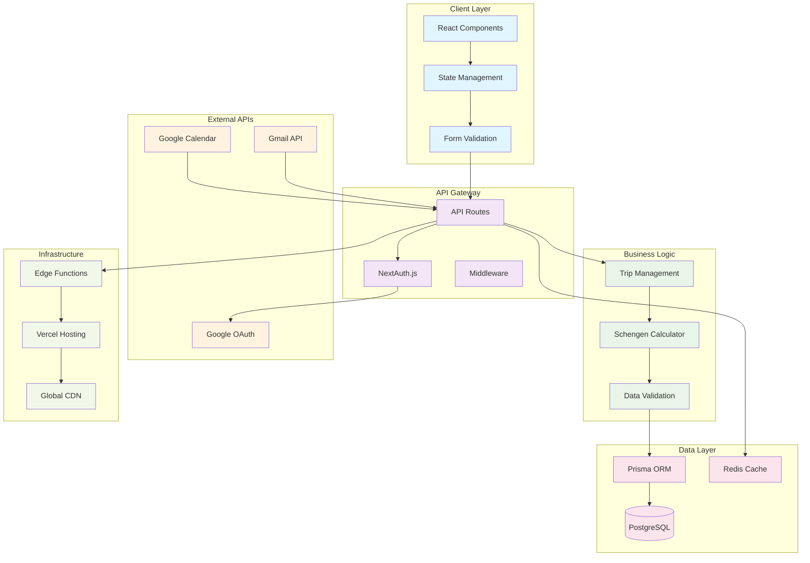
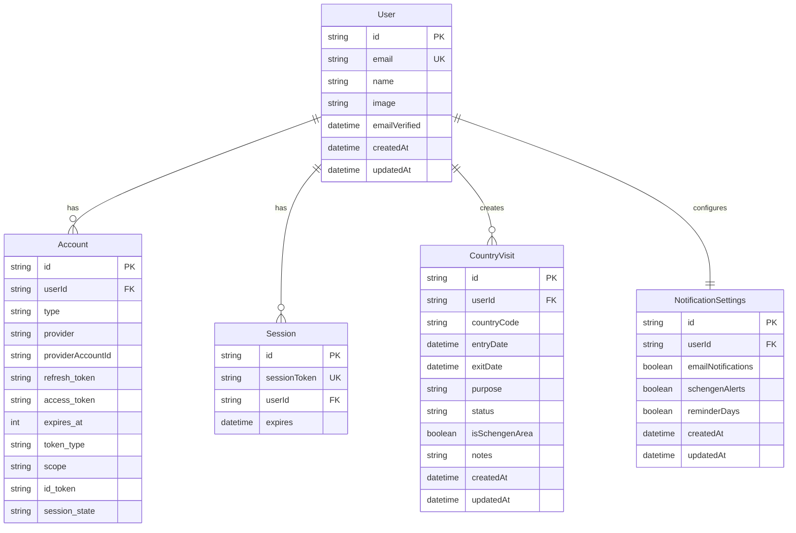
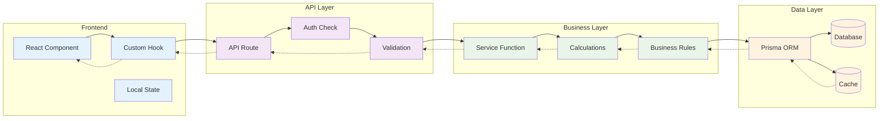
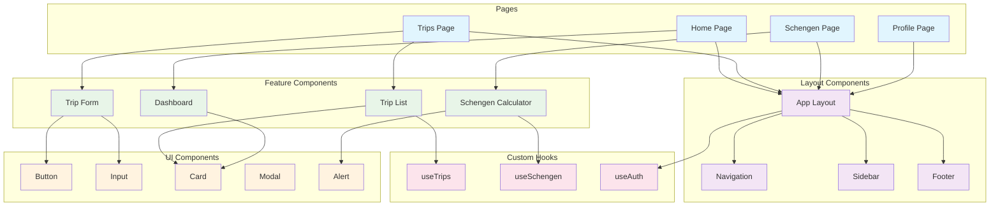
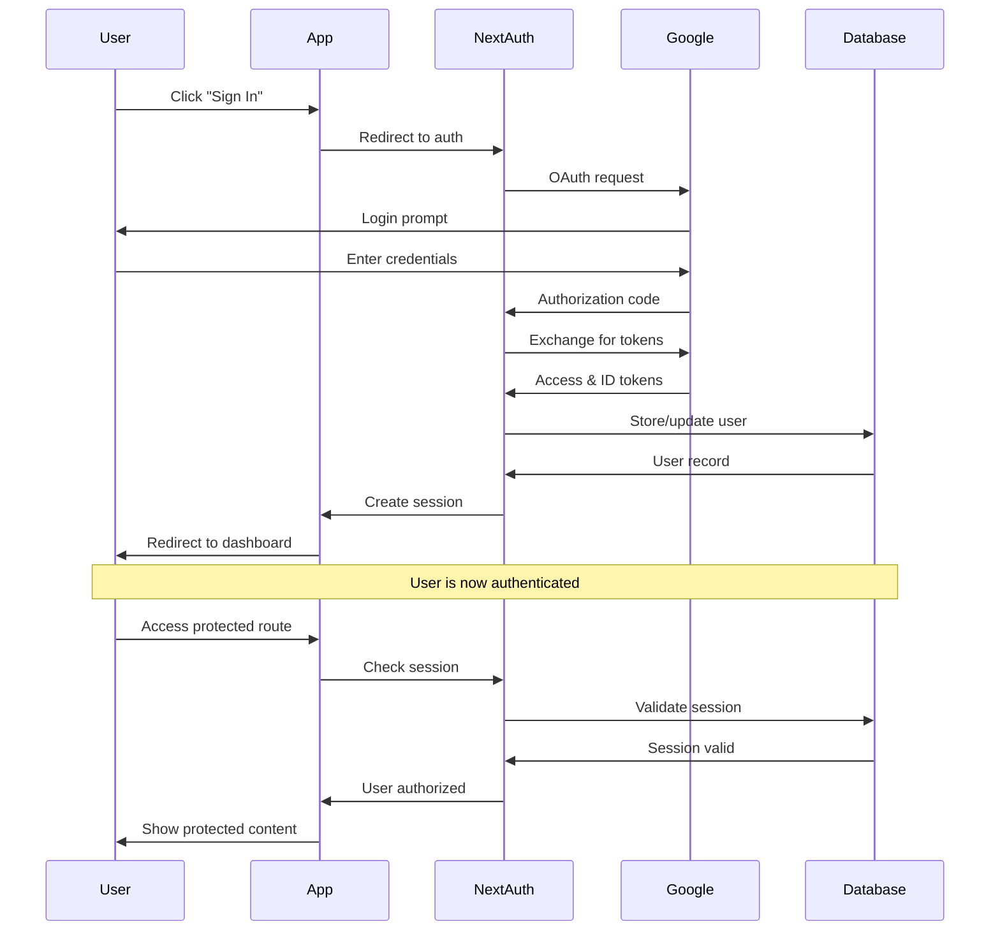
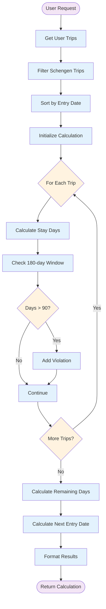
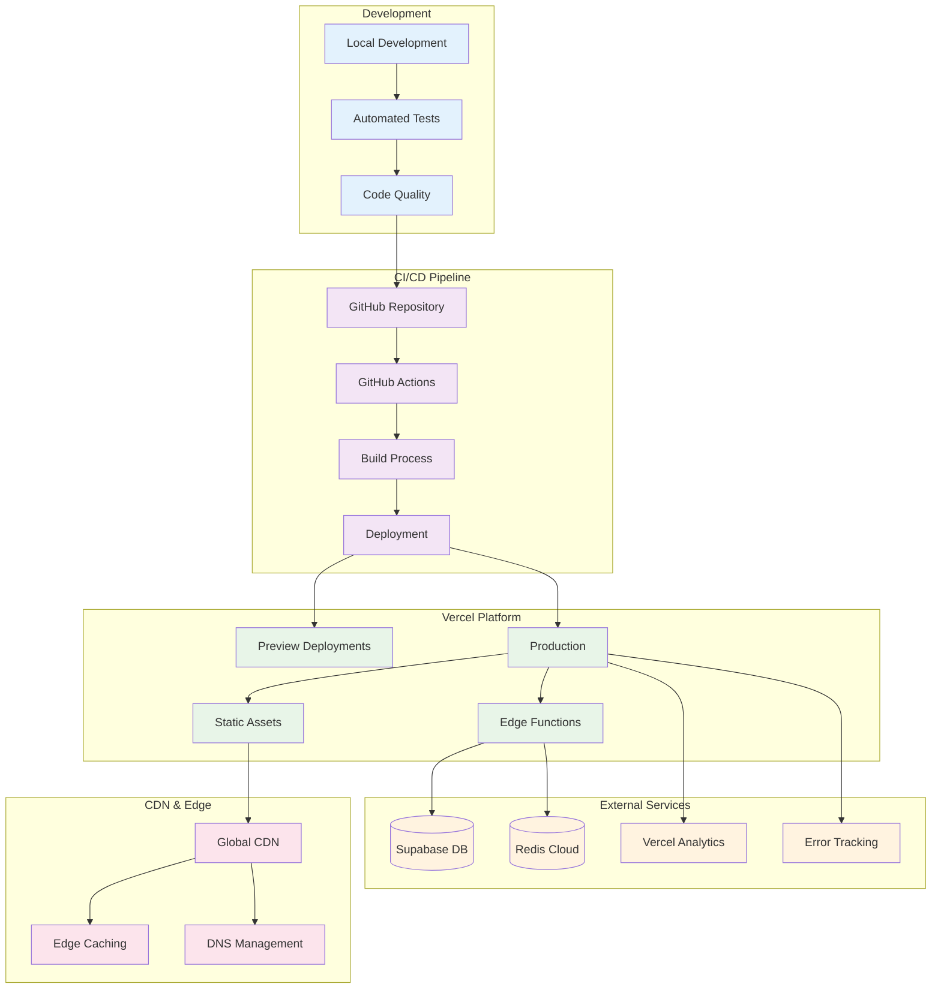
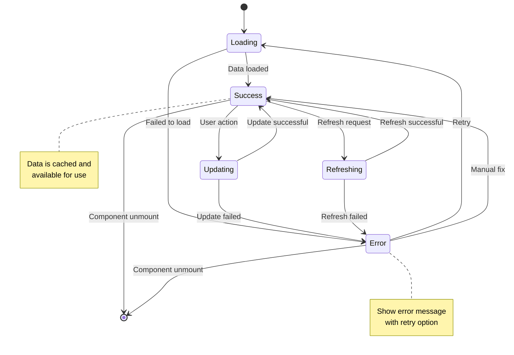
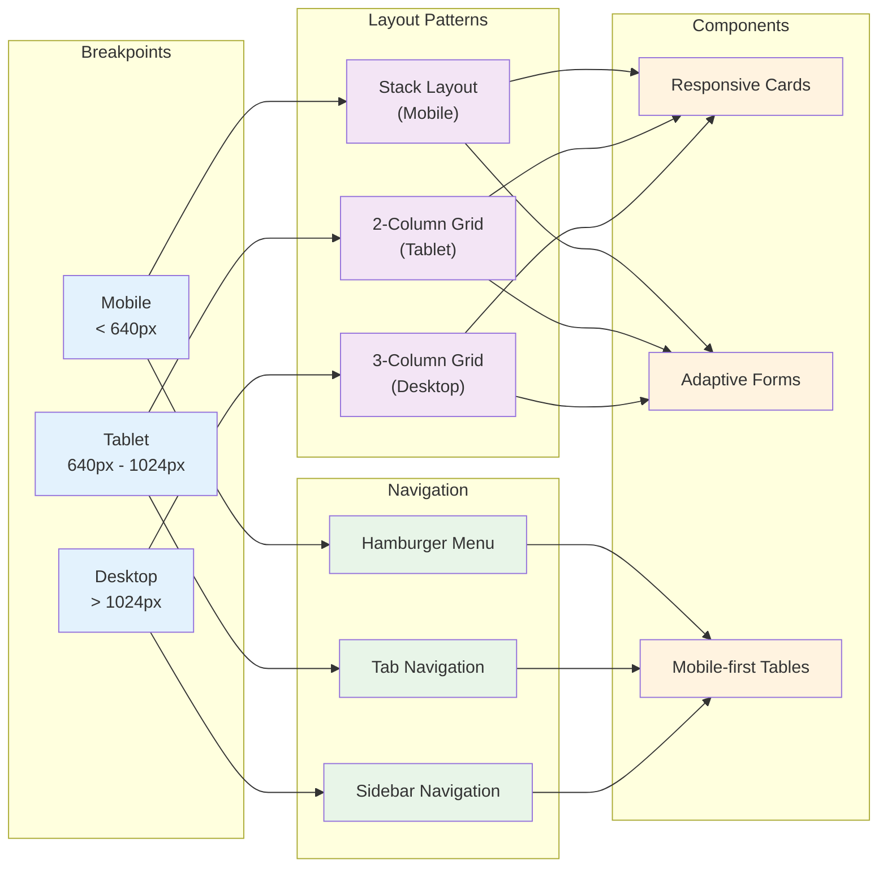

# DINO App System Architecture

This document provides visual architecture diagrams for the DINO travel management application, illustrating system components, data flow, and integrations.

## 🏗️ Overall System Architecture



## 🗄️ Database Schema



## 🔄 Data Flow Architecture



## 🧩 Component Architecture



## 🔐 Authentication Flow



## 📊 Schengen Calculation Flow



## 🌐 API Architecture

```mermaid
graph TB
    subgraph "Client Requests"
        WebApp[Web App]
        Mobile[Mobile App]
        External[External API]
    end
    
    subgraph "API Gateway"
        CORS[CORS Handler]
        RateLimit[Rate Limiting]
        Auth[Authentication]
    end
    
    subgraph "API Routes"
        TripsAPI[/api/trips]
        SchengenAPI[/api/schengen]
        UserAPI[/api/user]
        AuthAPI[/api/auth]
    end
    
    subgraph "Middleware"
        Validation[Request Validation]
        Logging[Request Logging]
        Error[Error Handling]
    end
    
    subgraph "Services"
        TripService[Trip Service]
        SchengenService[Schengen Service]
        UserService[User Service]
    end
    
    subgraph "Data Access"
        Prisma[Prisma Client]
        Cache[Redis Cache]
        DB[(PostgreSQL)]
    end

    WebApp --> CORS
    Mobile --> CORS
    External --> CORS
    
    CORS --> RateLimit
    RateLimit --> Auth
    
    Auth --> TripsAPI
    Auth --> SchengenAPI
    Auth --> UserAPI
    Auth --> AuthAPI
    
    TripsAPI --> Validation
    SchengenAPI --> Validation
    UserAPI --> Validation
    
    Validation --> TripService
    Validation --> SchengenService
    Validation --> UserService
    
    TripService --> Prisma
    SchengenService --> Prisma
    UserService --> Prisma
    
    Prisma --> Cache
    Prisma --> DB
    
    Validation --> Logging
    Logging --> Error

    classDef client fill:#e1f5fe
    classDef gateway fill:#f3e5f5
    classDef routes fill:#e8f5e8
    classDef middleware fill:#fff3e0
    classDef services fill:#fce4ec
    classDef data fill:#f1f8e9

    class WebApp,Mobile,External client
    class CORS,RateLimit,Auth gateway
    class TripsAPI,SchengenAPI,UserAPI,AuthAPI routes
    class Validation,Logging,Error middleware
    class TripService,SchengenService,UserService services
    class Prisma,Cache,DB data
```

## 🚀 Deployment Architecture



## 🔄 State Management Flow



## 📱 Responsive Design Architecture



---

These architecture diagrams provide a comprehensive visual overview of the DINO application's:

- ✅ **System Architecture**: Overall component relationships and data flow
- ✅ **Database Schema**: Entity relationships and data structure
- ✅ **Component Hierarchy**: React component organization
- ✅ **Authentication Flow**: OAuth and session management
- ✅ **Business Logic**: Schengen calculation process
- ✅ **API Design**: RESTful endpoint architecture
- ✅ **Deployment Pipeline**: CI/CD and hosting infrastructure
- ✅ **State Management**: Application state flow
- ✅ **Responsive Design**: Multi-device layout patterns

Each diagram uses Mermaid syntax for easy rendering and maintenance within the documentation system.