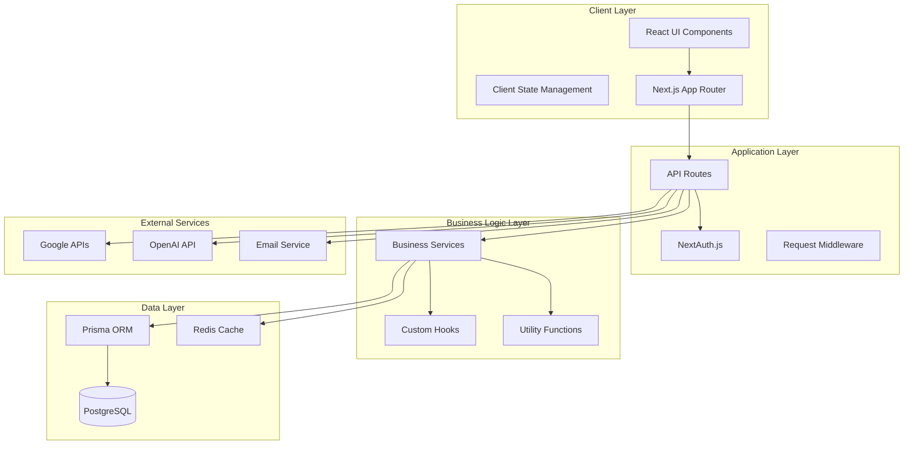
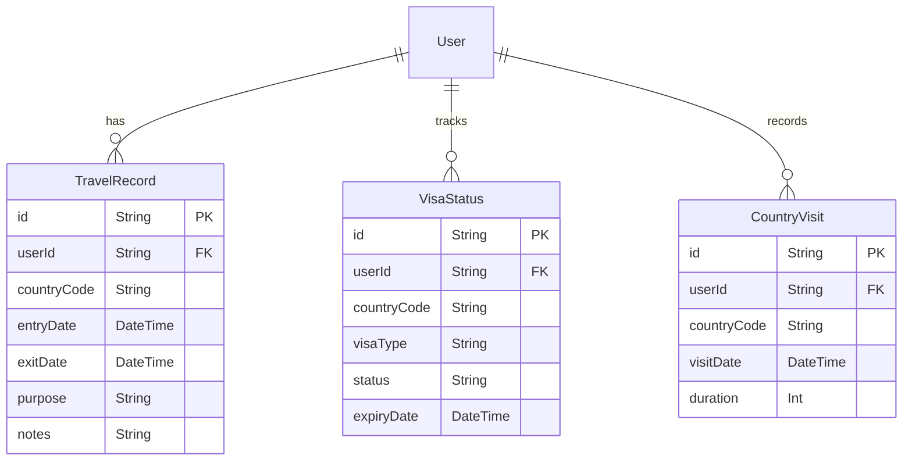
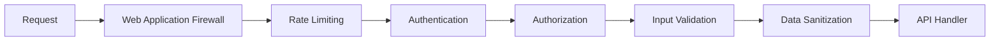
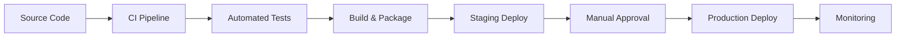
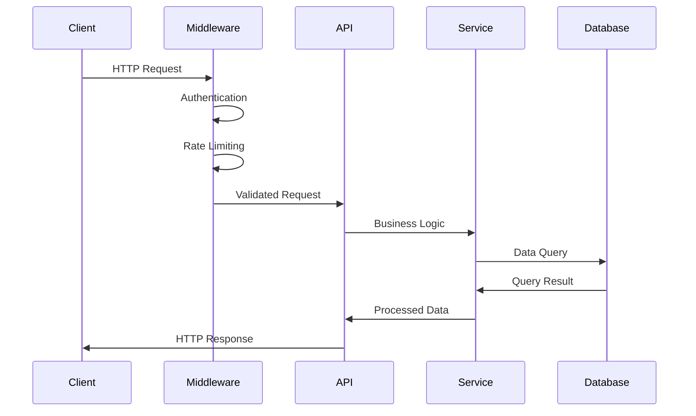
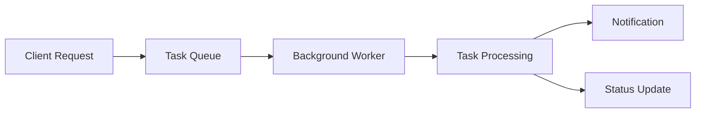

# 시스템 아키텍처 가이드

DINOapp의 전체 시스템 아키텍처와 설계 원칙을 설명합니다.

## 🏗️ 전체 아키텍처



## 🎯 설계 원칙

### 1. 단일 책임 원칙 (SRP)
- 각 컴포넌트와 함수는 하나의 명확한 책임만 가집니다
- 비즈니스 로직과 UI 로직을 분리합니다

### 2. 의존성 역전 원칙 (DIP)
- 상위 모듈은 하위 모듈에 의존하지 않습니다
- 추상화에 의존하며, 구체적인 구현에 의존하지 않습니다

### 3. 개방-폐쇄 원칙 (OCP)
- 확장에는 열려있고, 수정에는 닫혀있습니다
- 새로운 기능은 기존 코드 수정 없이 추가 가능합니다

## 📱 프론트엔드 아키텍처

### 컴포넌트 구조
```
components/
├── ui/                    # 기본 UI 컴포넌트
│   ├── Button.tsx
│   ├── Input.tsx
│   └── Modal.tsx
├── features/              # 기능별 컴포넌트
│   ├── auth/
│   ├── dashboard/
│   └── travel/
└── layout/                # 레이아웃 컴포넌트
    ├── Header.tsx
    ├── Sidebar.tsx
    └── Footer.tsx
```

### 상태 관리 전략
- **로컬 상태**: React useState/useReducer
- **서버 상태**: SWR/React Query (향후 고려)
- **전역 상태**: React Context API
- **폼 상태**: React Hook Form

### 라우팅 구조
```
app/
├── (auth)/               # 인증 그룹
│   ├── signin/
│   └── signup/
├── dashboard/            # 대시보드
│   ├── page.tsx
│   └── layout.tsx
├── travel/               # 여행 관리
│   ├── countries/
│   ├── visas/
│   └── schengen/
└── api/                  # API 라우트
    ├── auth/
    ├── travel/
    └── ai/
```

## 🛠️ 백엔드 아키텍처

### API 계층 구조
```
app/api/
├── auth/                 # 인증 관련 API
├── travel/               # 여행 관리 API
│   ├── countries/
│   ├── visas/
│   └── schengen/
├── ai/                   # AI 기능 API
├── admin/                # 관리자 API
└── health/               # 헬스 체크
```

### 서비스 레이어
```
lib/services/
├── auth-service.ts       # 인증 서비스
├── travel-service.ts     # 여행 관리 서비스
├── ai-service.ts         # AI 서비스
├── email-service.ts      # 이메일 서비스
└── notification-service.ts
```

### 데이터베이스 설계

#### 주요 엔티티


## 🔐 보안 아키텍처

### 인증 및 인가
- **NextAuth.js**: OAuth 2.0 기반 인증
- **JWT**: 세션 토큰 관리
- **RBAC**: 역할 기반 접근 제어

### 보안 레이어


### 데이터 보호
- **암호화**: 민감 데이터 AES-256 암호화
- **해싱**: 비밀번호 bcrypt 해싱
- **SQL 인젝션 방지**: Prisma ORM 사용
- **XSS 방지**: Content Security Policy

## 🚀 배포 아키텍처

### CI/CD 파이프라인


### 인프라 구조
- **호스팅**: Vercel (Frontend + API)
- **데이터베이스**: PostgreSQL (Supabase/Railway)
- **파일 저장**: Vercel Blob/AWS S3
- **모니터링**: Vercel Analytics + Custom Metrics
- **로깅**: Structured Logging + Log Aggregation

## 📊 모니터링 & 관찰가능성

### 메트릭 수집
```typescript
// 예시: HTTP 요청 메트릭
export class HttpMetrics {
  private static instance: HttpMetrics;
  
  requestStart(method: string, path: string): void {
    // 요청 시작 메트릭
  }
  
  requestEnd(method: string, path: string, statusCode: number): void {
    // 요청 완료 메트릭
  }
  
  histogram(name: string, value: number): void {
    // 히스토그램 메트릭
  }
}
```

### 로깅 전략
- **구조화 로깅**: JSON 형태로 일관된 로그
- **로그 레벨**: ERROR, WARN, INFO, DEBUG
- **컨텍스트**: 요청 ID, 사용자 ID, 세션 ID
- **민감 정보 제외**: 개인정보 및 인증 정보 로깅 금지

## 🔄 데이터 플로우

### 일반적인 요청 플로우


### 비동기 작업 플로우


## 🧪 테스트 아키텍처

### 테스트 피라미드
```
        /\
       /  \
      / E2E \     (적음, 느림, 비쌈)
     /______\
    /        \
   / Integration\ (보통)
  /______________\
 /                \
/   Unit Tests     \ (많음, 빠름, 저렴)
/__________________\
```

### 테스트 전략
- **단위 테스트**: Jest + React Testing Library
- **통합 테스트**: API 라우트 테스트
- **E2E 테스트**: Playwright
- **시각적 테스트**: 스크린샷 비교 (향후)

## 📈 성능 최적화

### 프론트엔드 최적화
- **코드 분할**: Next.js dynamic imports
- **이미지 최적화**: Next.js Image 컴포넌트
- **번들 분석**: webpack-bundle-analyzer
- **캐싱**: Browser cache + CDN

### 백엔드 최적화
- **데이터베이스 최적화**: 인덱스 + 쿼리 최적화
- **API 캐싱**: Redis + API 레벨 캐싱
- **연결 풀링**: Database connection pooling
- **압축**: gzip/brotli 압축

## 🔮 확장성 고려사항

### 수평 확장 준비
- **무상태 설계**: 서버 인스턴스 간 상태 공유 없음
- **데이터베이스 샤딩**: 사용자별 데이터 분산 (향후)
- **마이크로서비스**: 도메인별 서비스 분리 (향후)
- **CDN**: 전역 콘텐츠 배포

### 성능 목표
- **응답 시간**: API < 200ms, 페이지 로드 < 3초
- **처리량**: 1000 req/sec 지원
- **가용성**: 99.9% 업타임
- **확장성**: 10만 사용자 지원

---

**관련 문서**: [개발환경 설정](./setup.md) | [API 문서](../api/README.md) | [배포 가이드](../operations/deployment.md)