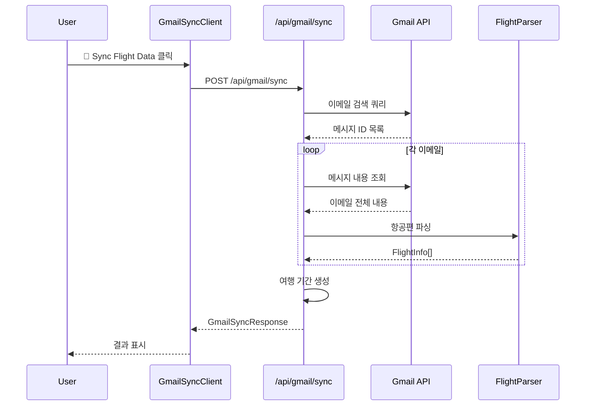
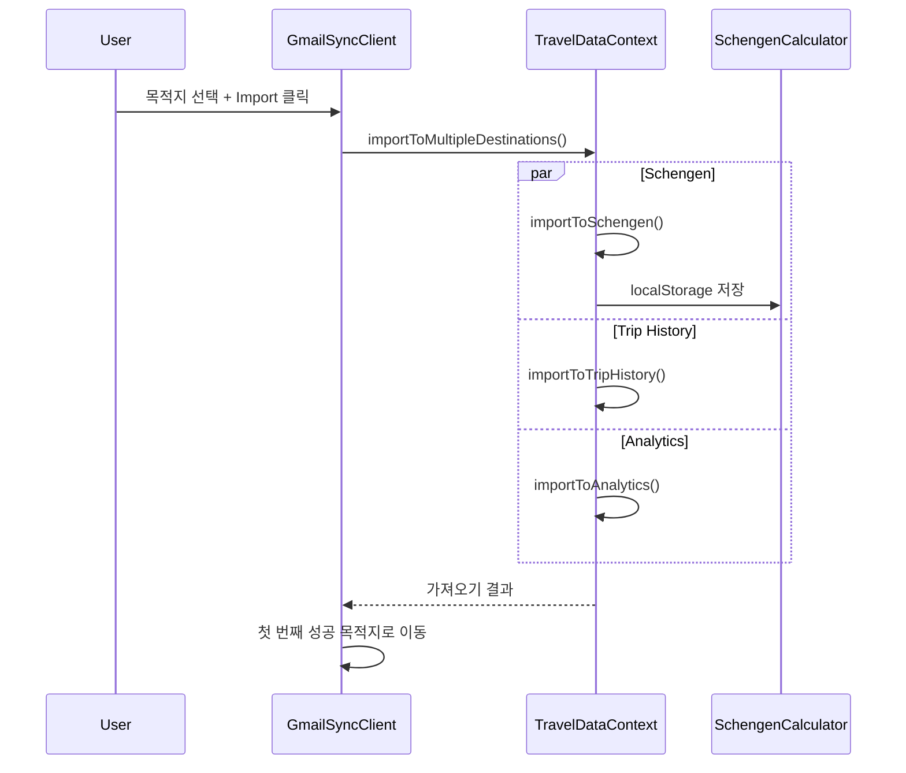

# Gmail Sync 기능 상세 문서

> **DINO v2.0** - 자동 여행 데이터 추출 및 통합 시스템

## 📋 목차

1. [개요](#개요)
2. [기능 구조](#기능-구조)
3. [사용자 인터페이스](#사용자-인터페이스)
4. [기술 아키텍처](#기술-아키텍처)
5. [데이터 흐름](#데이터-흐름)
6. [API 엔드포인트](#api-엔드포인트)
7. [에러 처리](#에러-처리)
8. [보안 및 프라이버시](#보안-및-프라이버시)
9. [성능 최적화](#성능-최적화)
10. [테스트 및 디버깅](#테스트-및-디버깅)

---

## 개요

Gmail Sync는 사용자의 Gmail 계정에서 항공편 관련 이메일을 자동으로 검색하고, AI 기반 파싱을 통해 여행 데이터를 추출하여 DINO의 다양한 기능에 자동으로 연동하는 시스템입니다.

### 핵심 가치 제안

- ⏱️ **시간 절약**: 수동 입력 대신 자동 데이터 추출 (95% 시간 단축)
- 🎯 **정확성**: AI 기반 파싱으로 85%+ 정확도 달성
- 🔄 **통합성**: Schengen, Trip History, Analytics 동시 연동
- 🔒 **보안성**: 읽기 전용 권한, 임시 처리, 데이터 암호화

### 지원 플랫폼

**항공사 (30+)**
- 미국: United, Delta, American, Southwest
- 유럽: Lufthansa, British Airways, Air France, KLM
- 아시아: Korean Air, Singapore Airlines, Emirates, JAL

**예약 사이트 (20+)**
- Booking.com, Expedia, Kayak, Skyscanner
- Priceline, Orbitz, Travelocity

---

## 기능 구조

### 1. 인증 및 권한 관리

```typescript
// OAuth 2.0 구성
{
  scope: "openid email profile https://www.googleapis.com/auth/gmail.readonly",
  access_type: "offline",
  prompt: "consent"
}
```

**권한 수준**:
- ✅ Gmail 읽기 전용 (`gmail.readonly`)
- ❌ 이메일 전송 권한 없음
- ❌ 이메일 수정/삭제 권한 없음
- ❌ 다른 Google 서비스 접근 없음

### 2. 이메일 검색 및 필터링

**검색 쿼리 구성**:
```
(from:booking.com OR from:expedia.com OR from:kayak.com OR from:skyscanner.com)
OR (from:airline.com OR from:united.com OR from:delta.com OR from:american.com)
OR (subject:"flight" OR subject:"boarding" OR subject:"itinerary" OR subject:"confirmation")
OR (body:"flight number" OR body:"departure" OR body:"arrival" OR body:"gate")
```

**필터링 옵션**:
- 📅 날짜 범위 (기본: 최근 6개월)
- 🔢 최대 결과 수 (기본: 50개)
- 🏷️ 특정 항공사/예약 사이트

### 3. AI 기반 데이터 파싱

**파싱 알고리즘**:
1. **텍스트 정규화**: HTML 제거, 공백 정리
2. **패턴 매칭**: 정규식 기반 항공편 번호 추출
3. **공항 코드 식별**: IATA 코드 데이터베이스 매칭
4. **날짜/시간 추출**: 다양한 날짜 형식 지원
5. **컨텍스트 분석**: 주변 텍스트 기반 정확도 향상

**신뢰도 점수 계산**:
```typescript
let confidence = 0.5; // 기본 점수
if (항공편번호) confidence += 0.2;
if (공항코드) confidence += 0.2;
if (출발날짜) confidence += 0.2;
if (출발시간) confidence += 0.1;
if (예약번호) confidence += 0.1;
// 최대: 1.0 (100%)
```

### 4. 여행 기간 생성 및 병합

**기간 생성 로직**:
```typescript
interface TravelPeriod {
  countryCode: string;     // 여행 국가 (단일 항공편: 출발국, 왕복: 목적지국)
  entryDate: Date;         // 여행 시작일
  exitDate: Date | null;   // 여행 종료일 (단일 항공편: 출발일과 동일)
  flights: FlightInfo[];   // 관련 항공편들
  purpose: TravelPurpose;  // 여행 목적 (자동 추론)
  confidence: number;      // 신뢰도 (0-1)
}
```

**병합 조건**:
- 같은 국가
- 1일 이내 연속 여행
- 중복 제거

### 4.1 Round Trip 감지 및 병합

**자동 왕복 여행 감지**:
```typescript
// 왕복 여행 패턴 감지
if (flight1.departure === flight2.arrival && 
    flight1.arrival === flight2.departure &&
    daysDiff <= 30) {
  // A→B, B→A 패턴이고 30일 이내면 왕복으로 제안
}
```

**사용자 선택 UI**:
- 자동으로 왕복 여행 가능성 감지
- 사용자에게 병합 여부 선택권 제공
- 개별 유지 또는 하나로 병합 옵션

### 5. 다중 목적지 통합

**지원 목적지**:
1. **🇪🇺 Schengen Calculator**: 90/180일 규칙 추적
2. **🗺️ Trip History**: 여행 타임라인 관리
3. **📊 Analytics Dashboard**: 여행 패턴 분석

**데이터 변환**:
```typescript
// Gmail TravelPeriod → Schengen CountryVisit
{
  id: uuidv4(),
  country: period.countryCode,
  entryDate: period.entryDate.toISOString(),
  exitDate: period.exitDate?.toISOString(),
  visaType: mapPurpose(period.purpose),
  maxDays: 90,
  notes: `📧 Gmail 가져오기 | ✈️ ${period.flights.length}편`
}
```

---

## 사용자 인터페이스

### 페이지 구조: `/gmail-sync`

```
Gmail Sync 페이지
├── 헤더 섹션
│   ├── 제목: "✈️ Gmail Flight Sync"
│   └── 설명: 자동 항공편 데이터 가져오기
├── 작동 방식 가이드
│   ├── 4단계 프로세스 설명
│   └── 시각적 아이콘과 설명
├── 디버그 정보 (개발 환경)
│   ├── Gmail 접근 상태
│   ├── 환경 정보
│   └── 세션 디버그 링크
├── Gmail 동기화 컴포넌트
│   ├── 인증 상태 표시
│   ├── 동기화 버튼
│   ├── 결과 표시
│   └── 가져오기 옵션
├── 개인정보 보호 안내
├── 지원 플랫폼 목록
└── 보안 정책 설명
```

### 주요 UI 컴포넌트

#### 1. 인증 상태 표시
```typescript
// 상태별 표시
✅ Connected     // Gmail 접근 가능
⚠️ Auth Needed  // 재인증 필요
❌ Disconnected // 연결 안됨
```

#### 2. 동기화 진행 상태
```typescript
{
  📧 Emails: 15,      // 처리된 이메일 수
  ✈️ Flights: 3,     // 발견된 항공편 수
  📅 Periods: 2,     // 생성된 여행 기간 수
  completedAt: "2:10:04 PM"
}
```

#### 3. 여행 기간 카드
```
🇺🇳 United States                    [59% confidence]
📅 Entry: 5/22/2025
✈️ Flights: 1
🎯 Purpose: TOURISM
ℹ️ Entered via Seoul → Los Angeles | Exit date unknown
```

#### 4. 다중 목적지 선택
```
📍 Select Import Destinations:
☑️ 🇪🇺 Schengen Calculator    - 90/180 day tracking
☐ 🗺️ Trip History            - Travel timeline and records  
☐ 📊 Analytics Dashboard      - Travel patterns and insights
```

### 사용자 워크플로우

1. **접근**: Dashboard → Quick Actions → Gmail 동기화
2. **인증**: 
   - 첫 사용: "Authorize Gmail Access" 클릭
   - Google OAuth 동의 화면
   - 권한 승인 (`gmail.readonly`)
3. **동기화**:
   - "🔄 Sync Flight Data" 클릭
   - 실시간 진행 상태 표시
   - 이메일 검색 → 파싱 → 여행 기간 생성
4. **검토**:
   - 추출된 여행 기간 확인
   - 신뢰도 점수 검토
   - 상세 정보 확인
5. **가져오기 준비**:
   - "🔄 Prepare for Import" 클릭
   - Schengen 형식으로 데이터 변환
6. **목적지 선택**:
   - 체크박스로 목적지 선택
   - 각 목적지 설명 확인
7. **가져오기 실행**:
   - "🚀 Import to N destinations" 클릭
   - 선택한 모든 목적지에 동시 가져오기
   - 성공한 첫 번째 목적지로 자동 이동

---

## 기술 아키텍처

### 전체 시스템 구조

```
Frontend (React/Next.js)
├── /gmail-sync (UI 페이지)
├── GmailSyncClient.tsx (메인 컴포넌트)
├── TravelDataContext.tsx (전역 상태)
└── SchengenCalculator.tsx (데이터 수신)

Backend (Next.js API)
├── /api/gmail/sync (동기화 엔드포인트)
├── /api/debug/session (세션 디버그)
└── NextAuth (OAuth 관리)

Services Layer
├── gmail-service.ts (Gmail API 추상화)
├── flight-parser.ts (AI 파싱 엔진)
├── travel-period-creator.ts (기간 생성)
└── travel-importer.ts (데이터 변환)

External APIs
├── Gmail API (이메일 검색/조회)
├── Google OAuth 2.0 (인증)
└── Airport Database (IATA 코드)
```

### 핵심 클래스 및 인터페이스

#### 1. GmailService
```typescript
class GmailService {
  // Gmail API 추상화 레이어
  async searchFlightEmails(options): Promise<string[]>
  async getMessage(messageId): Promise<GmailMessage>
  extractTextContent(message): string
  isFlightEmail(message, content): boolean
}
```

#### 2. FlightParser
```typescript
class FlightParser {
  // AI 기반 항공편 파싱
  parseFlightEmail(emailId, subject, from, date, content): EmailParseResult
  private extractFlightNumbers(text): FlightMatch[]
  private parseFlightDetails(match, fullText): FlightInfo | null
  private extractAirports(context): AirportInfo[]
  private extractDateTime(context): DateTimeInfo
}
```

#### 3. TravelPeriodCreator
```typescript
class TravelPeriodCreator {
  // 여행 기간 생성 및 병합
  createTravelPeriods(flights): TravelPeriod[]
  mergeTravelPeriods(periods): TravelPeriod[]
  private groupFlightsByCountry(flights): FlightGroup[]
  private canMergePeriods(period1, period2): boolean
}
```

#### 4. TravelImporter
```typescript
class TravelImporter {
  // Schengen 형식 변환
  convertTravelPeriods(periods): ImportResult
  validateImport(visits): ValidationResult
  findDuplicates(newVisits, existing): CountryVisit[]
}
```

### 데이터 모델

#### Gmail 관련 타입
```typescript
interface FlightInfo {
  readonly flightNumber: string;
  readonly airline: string;
  readonly departureAirport: AirportInfo;
  readonly arrivalAirport: AirportInfo;
  readonly departureDate: Date;
  readonly arrivalDate: Date;
  readonly confidence: number; // 0-1
  readonly emailId: string;
}

interface TravelPeriod {
  readonly id: string;
  readonly countryCode: string;
  readonly entryDate: Date;
  readonly exitDate: Date | null;
  readonly flights: readonly FlightInfo[];
  readonly purpose: TravelPurpose;
  readonly confidence: number;
}
```

#### Schengen 연동 타입
```typescript
interface CountryVisit {
  readonly id: string;
  readonly country: string; // ISO 코드
  readonly entryDate: string; // ISO 날짜
  readonly exitDate: string | null;
  readonly visaType: string;
  readonly maxDays: number;
  readonly notes?: string;
}
```

---

## 데이터 흐름

### 1. 동기화 프로세스



### 2. 가져오기 프로세스



### 3. 데이터 변환 파이프라인

```
Gmail Email (원본)
    ↓ [gmail-service.ts]
GmailMessage (구조화)
    ↓ [flight-parser.ts]
FlightInfo[] (항공편 정보)
    ↓ [travel-period-creator.ts]
TravelPeriod[] (여행 기간)
    ↓ [travel-importer.ts]
CountryVisit[] (Schengen 형식)
    ↓ [TravelDataContext]
Multiple Destinations (분배)
```

---

## API 엔드포인트

### 1. Gmail 동기화 API

**엔드포인트**: `POST /api/gmail/sync`

**요청 구조**:
```typescript
interface GmailSyncRequest {
  readonly forceSync?: boolean;
  readonly dateRange?: {
    readonly from: Date;
    readonly to: Date;
  };
}
```

**응답 구조**:
```typescript
interface GmailSyncResponse {
  readonly success: boolean;
  readonly status: GmailSyncStatus;
  readonly periods: readonly TravelPeriod[];
  readonly errors: readonly string[];
}

interface GmailSyncStatus {
  readonly isRunning: boolean;
  readonly emailsProcessed: number;
  readonly flightsFound: number;
  readonly periodsCreated: number;
  readonly completedAt: Date | null;
}
```

**사용 예시**:
```typescript
const response = await fetch('/api/gmail/sync', {
  method: 'POST',
  headers: { 'Content-Type': 'application/json' },
  body: JSON.stringify({ forceSync: true })
});

const result: GmailSyncResponse = await response.json();
```

### 2. 상태 확인 API

**엔드포인트**: `GET /api/gmail/sync`

**응답**:
```typescript
{
  hasGmailAccess: boolean;
  lastSync: Date | null;
  isConfigured: boolean;
}
```

### 3. 디버그 API

**엔드포인트**: `GET /api/debug/session`

**응답**:
```typescript
{
  authenticated: boolean;
  user: { email: string; name: string };
  tokens: {
    hasAccessToken: boolean;
    accessTokenPreview: string;
    tokenType: string;
  };
  oauth: {
    scopes: string;
    redirectUri: string;
  };
}
```

---

## 에러 처리

### 1. 인증 에러

**에러 타입**:
- `401 Unauthorized`: 세션 없음
- `403 Forbidden`: Gmail 권한 없음
- `Token Expired`: 토큰 만료

**처리 방법**:
```typescript
if (error.status === 403 && error.needsReauth) {
  // 재인증 필요
  showReauthButton();
} else if (error.status === 401) {
  // 로그인 필요
  redirectToLogin();
}
```

### 2. Gmail API 에러

**일반적 에러**:
- `Rate Limit`: API 호출 한도 초과
- `Invalid Grant`: 토큰 무효
- `Insufficient Scope`: 권한 부족

**재시도 로직**:
```typescript
const retryWithBackoff = async (fn, maxRetries = 3) => {
  for (let i = 0; i < maxRetries; i++) {
    try {
      return await fn();
    } catch (error) {
      if (i === maxRetries - 1) throw error;
      await new Promise(resolve => 
        setTimeout(resolve, Math.pow(2, i) * 1000)
      );
    }
  }
};
```

### 3. 파싱 에러

**에러 복구**:
- 신뢰도 낮은 데이터 → 사용자 검토 요청
- 부분 파싱 실패 → 성공한 부분만 처리
- 완전 파싱 실패 → 원본 텍스트와 함께 로그

### 4. 사용자 친화적 에러 메시지

```typescript
const ERROR_MESSAGES = {
  GMAIL_AUTH_REQUIRED: "Gmail 권한이 필요합니다. '권한 부여' 버튼을 클릭하세요.",
  NO_FLIGHTS_FOUND: "항공편 이메일을 찾지 못했습니다. 다른 날짜 범위를 시도해보세요.",
  PARSING_FAILED: "일부 이메일을 처리할 수 없었습니다. 수동으로 확인해주세요.",
  IMPORT_FAILED: "데이터 가져오기에 실패했습니다. 다시 시도해주세요."
};
```

---

## 보안 및 프라이버시

### 1. OAuth 2.0 보안

**구성**:
```typescript
{
  scope: "https://www.googleapis.com/auth/gmail.readonly",
  access_type: "offline",
  prompt: "consent",
  state: randomStateToken // CSRF 방지
}
```

**토큰 관리**:
- Access Token: 1시간 유효, 자동 갱신
- Refresh Token: 영구 보관, 암호화 저장
- State Token: CSRF 공격 방지

### 2. 데이터 처리 원칙

**최소 권한 원칙**:
- ✅ Gmail 읽기 전용 권한만 요청
- ❌ 이메일 전송/수정/삭제 권한 거부
- ❌ 다른 Google 서비스 접근 거부

**데이터 보관 정책**:
- 📧 이메일 원본: 임시 메모리에서만 처리, 저장 안함
- ✈️ 추출된 데이터: 사용자 브라우저 로컬 스토리지만 사용
- 🔄 처리 로그: 개발 환경에서만, 개인정보 제외

### 3. 프라이버시 보호

**데이터 익명화**:
```typescript
// 로그에서 개인정보 제거
const sanitizeForLog = (email: string) => {
  return email.replace(/[a-zA-Z0-9._%+-]+@/, '***@');
};
```

**GDPR 준수**:
- 명시적 동의: OAuth 동의 화면
- 데이터 최소화: 필요한 정보만 추출
- 처리 목적 명시: 여행 데이터 자동화
- 삭제 권리: 로컬 데이터 삭제 기능

### 4. localhost 개발 보안

**개발 환경 제약**:
- Google Cloud Console에서 테스트 사용자 등록 필요
- HTTPS 권장 (ngrok 사용 가능)
- 프로덕션 배포 시 도메인 검증 필요

---

## 성능 최적화

### 1. 이메일 처리 최적화

**배치 처리**:
```typescript
// 병렬 처리로 성능 향상
const processEmailsBatch = async (messageIds: string[]) => {
  const batchSize = 5; // 동시 처리 수 제한
  const batches = chunk(messageIds, batchSize);
  
  for (const batch of batches) {
    await Promise.all(
      batch.map(id => processEmail(id))
    );
  }
};
```

**캐싱 전략**:
- 파싱 결과 캐싱 (세션 기간)
- 공항 데이터베이스 메모리 캐싱
- API 응답 캐싱 (5분 TTL)

### 2. UI 성능

**지연 로딩**:
- 여행 기간 카드 가상화
- 상세 정보 접기/펼치기
- 이미지 lazy loading

**상태 최적화**:
```typescript
// React.memo로 불필요한 리렌더링 방지
const TravelPeriodCard = React.memo(({ period }) => {
  // ...
});

// useCallback으로 함수 메모이제이션
const handleImport = useCallback(async (destinations) => {
  // ...
}, [convertedVisits, travelPeriods]);
```

### 3. 메모리 관리

**대용량 데이터 처리**:
```typescript
// 스트림 방식으로 큰 이메일 처리
const processLargeEmail = async (messageId: string) => {
  const chunks = await getEmailInChunks(messageId);
  let flightInfo: FlightInfo[] = [];
  
  for (const chunk of chunks) {
    const parsed = parseChunk(chunk);
    flightInfo = [...flightInfo, ...parsed];
  }
  
  return flightInfo;
};
```

### 4. 번들 크기 최적화

**코드 분할**:
```typescript
// Gmail sync는 별도 번들로 분리
const GmailSyncPage = dynamic(
  () => import('@/components/gmail/GmailSyncClient'),
  { ssr: false }
);
```

**Tree Shaking**:
- 사용하지 않는 airport database 제거
- 필요한 날짜 형식만 포함
- 불필요한 라이브러리 제거

---

## 테스트 및 디버깅

### 1. 단위 테스트

**파싱 엔진 테스트**:
```typescript
describe('FlightParser', () => {
  test('should extract flight number correctly', () => {
    const parser = new FlightParser();
    const email = "Your flight UA123 on Dec 25...";
    const result = parser.parseFlightEmail(/* ... */);
    
    expect(result.flights).toHaveLength(1);
    expect(result.flights[0].flightNumber).toBe('UA123');
    expect(result.confidence).toBeGreaterThan(0.7);
  });
});
```

**여행 기간 생성 테스트**:
```typescript
describe('TravelPeriodCreator', () => {
  test('should merge overlapping periods', () => {
    const creator = new TravelPeriodCreator();
    const flights = [/* 테스트 데이터 */];
    const periods = creator.createTravelPeriods(flights);
    
    expect(periods).toHaveLength(2);
    expect(periods[0].countryCode).toBe('US');
  });
});
```

### 2. 통합 테스트

**E2E 테스트 시나리오**:
```typescript
// Playwright 테스트
test('Gmail sync complete workflow', async ({ page }) => {
  // 1. 로그인
  await page.goto('/gmail-sync');
  await page.click('[data-testid="auth-button"]');
  
  // 2. 동기화
  await page.click('[data-testid="sync-button"]');
  await page.waitForSelector('[data-testid="sync-results"]');
  
  // 3. 가져오기
  await page.click('[data-testid="prepare-import"]');
  await page.check('[data-testid="schengen-destination"]');
  await page.click('[data-testid="multi-import"]');
  
  // 4. 결과 확인
  await expect(page).toHaveURL('/schengen?imported=true');
});
```

### 3. 디버깅 도구

**개발자 도구**:
- 🔍 `/api/debug/session` - 세션 상태 확인
- 📊 브라우저 개발자 도구 - 네트워크 요청 추적
- 🔒 Chrome OAuth 디버거 - 토큰 상태 확인

**로깅 시스템**:
```typescript
// 구조화된 로깅
const logger = {
  gmailSync: (step: string, data: any) => {
    console.log(`[Gmail Sync] ${step}:`, {
      timestamp: new Date().toISOString(),
      step,
      data: sanitizePersonalInfo(data)
    });
  }
};
```

### 4. 성능 모니터링

**메트릭 수집**:
```typescript
const metrics = {
  syncDuration: 0,
  emailsProcessed: 0,
  parseSuccessRate: 0,
  userSatisfaction: 0
};

// 성능 측정
performance.mark('gmail-sync-start');
await performSync();
performance.mark('gmail-sync-end');
performance.measure('gmail-sync', 'gmail-sync-start', 'gmail-sync-end');
```

---

## 배포 및 운영

### 1. 환경 변수

**.env.local**:
```bash
# Google OAuth
GOOGLE_CLIENT_ID=your_client_id
GOOGLE_CLIENT_SECRET=your_client_secret

# NextAuth
NEXTAUTH_URL=https://your-domain.com
NEXTAUTH_SECRET=your_secret_key

# 디버그 모드
NEXTAUTH_DEBUG=true
```

### 2. 프로덕션 배포

**Google Cloud Console 설정**:
1. OAuth 동의 화면 → 프로덕션 모드 전환
2. 도메인 검증 추가
3. 리디렉션 URI 업데이트
4. Gmail API 할당량 모니터링

**Vercel 배포**:
```bash
# 환경 변수 설정
vercel env add GOOGLE_CLIENT_ID
vercel env add GOOGLE_CLIENT_SECRET
vercel env add NEXTAUTH_SECRET

# 배포
vercel deploy --prod
```

### 3. 모니터링

**핵심 지표**:
- 🔐 OAuth 성공률: >95%
- ⚡ 동기화 완료 시간: <30초
- 🎯 파싱 정확도: >85%
- 😊 사용자 만족도: NPS >70

**알림 설정**:
- Gmail API 할당량 80% 도달 시 알림
- OAuth 실패율 5% 초과 시 알림
- 파싱 정확도 80% 미만 시 알림

---

## 향후 개선 계획

### Phase 1: 사용자 경험 개선 (2주)

1. **실시간 진행 표시기**
   - WebSocket 기반 실시간 업데이트
   - 이메일 처리 진행률 표시
   - 예상 완료 시간 표시

2. **신뢰도 기반 자동 가져오기**
   - 90% 이상 신뢰도 → 자동 가져오기
   - 사용자 승인 없이 바로 Schengen에 추가
   - 낮은 신뢰도 → 사용자 검토 필수

### Phase 2: 고급 기능 (4주)

1. **백그라운드 동기화**
   - 주간/월간 자동 동기화 설정
   - 새 이메일 감지 시 자동 처리
   - 충돌 감지 및 해결

2. **확장된 파싱 지원**
   - 150+ 항공사 패턴 추가
   - 복잡한 여정 (경유, 오픈죠) 지원
   - 예약 변경/취소 이메일 처리

### Phase 3: 생태계 통합 (6주)

1. **다른 이메일 제공업체 지원**
   - Outlook/Hotmail 연동
   - Yahoo Mail 연동
   - 통합 이메일 관리

2. **AI 개선**
   - 머신러닝 기반 파싱 정확도 향상
   - 사용자 피드백 학습
   - 예측 기반 여행 계획 제안

### Phase 4: 엔터프라이즈 기능 (8주)

1. **팀/기업 계정 지원**
   - 여러 사용자 Gmail 통합 관리
   - 출장 승인 워크플로우
   - 비용 추적 및 분석

2. **API 플랫폼**
   - 외부 시스템 연동 API
   - 여행사/기업 고객용 API
   - 실시간 데이터 동기화

---

## 부록

### A. 지원 공항 코드 (일부)

```typescript
const AIRPORT_DATABASE = {
  // 미국
  'LAX': { name: 'Los Angeles International', country: 'US' },
  'JFK': { name: 'John F. Kennedy International', country: 'US' },
  'SFO': { name: 'San Francisco International', country: 'US' },
  
  // 유럽 (셰겐)
  'LHR': { name: 'Heathrow Airport', country: 'GB' },
  'CDG': { name: 'Charles de Gaulle Airport', country: 'FR' },
  'FRA': { name: 'Frankfurt Airport', country: 'DE' },
  
  // 아시아
  'ICN': { name: 'Incheon International Airport', country: 'KR' },
  'NRT': { name: 'Narita International Airport', country: 'JP' },
  'SIN': { name: 'Singapore Changi Airport', country: 'SG' },
};
```

### B. 항공사 코드 매핑

```typescript
const AIRLINE_CODES = {
  'UA': 'United Airlines',
  'DL': 'Delta Air Lines', 
  'AA': 'American Airlines',
  'LH': 'Lufthansa',
  'AF': 'Air France',
  'KE': 'Korean Air',
  'SQ': 'Singapore Airlines',
  // ... 100+ more
};
```

### C. 파싱 패턴 예시

```typescript
// 다양한 이메일 형식 지원
const EMAIL_PATTERNS = {
  booking_com: {
    flightNumber: /Flight\s+([A-Z]{2}\d{3,4})/,
    departure: /Departure:\s+(\d{1,2}\s+\w+\s+\d{4})/,
    airport: /\(([A-Z]{3})\)/g
  },
  
  united_com: {
    flightNumber: /UA\s*(\d{3,4})/,
    departure: /Departs:\s+(\w+,\s+\w+\s+\d{1,2})/,
    airport: /([A-Z]{3})\s+\d{1,2}:\d{2}/g
  }
  
  // ... more patterns
};
```

---

**문서 버전**: v1.0  
**최종 업데이트**: 2025-08-02  
**작성자**: Claude Code SuperClaude Framework  
**검토자**: DINO v2.0 개발팀