# 배포 및 운영 가이드

DINOapp의 프로덕션 배포, 모니터링, 유지보수를 위한 완전한 운영 가이드입니다.

## 🚀 배포 프로세스

### 자동화된 CI/CD 파이프라인

#### 1. GitHub Actions 워크플로우

```yaml
# 자동 트리거
main 브랜치 푸시 → CI 실행 → 스테이징 배포 → 수동 승인 → 프로덕션 배포
```

#### 2. 품질 게이트

```mermaid
graph LR
    A[코드 푸시] --> B[코드 품질 검사]
    B --> C[테스트 실행]
    C --> D[E2E 테스트]
    D --> E[성능 테스트]
    E --> F[빌드 & 패키징]
    F --> G[스테이징 배포]
    G --> H[수동 승인]
    H --> I[프로덕션 배포]
```



### 수동 배포

#### 개발 환경

```bash
npm run dev
```

#### 스테이징 배포

```bash
# Vercel 스테이징 환경
vercel --env NODE_ENV=staging
```

#### 프로덕션 배포

```bash
# 프로덕션 배포 (수동)
vercel --prod

# 또는 npm 스크립트 사용
npm run deploy:production
```

### 환경 설정

#### 환경 변수 관리

```bash
# 프로덕션 환경 변수 (Vercel)
DATABASE_URL=postgresql://...
NEXTAUTH_SECRET=production-secret
NEXTAUTH_URL=https://dinoapp.vercel.app
GOOGLE_CLIENT_ID=prod-client-id
GOOGLE_CLIENT_SECRET=prod-client-secret
```

#### 스테이징 환경 변수

```bash
# 스테이징 환경 변수
NODE_ENV=staging
DATABASE_URL=postgresql://staging-db...
NEXTAUTH_URL=https://dinoapp-staging.vercel.app
```

## 📊 모니터링 시스템

### 시스템 모니터링

#### 헬스 체크 엔드포인트

```typescript
// GET /api/health
{
  "status": "healthy",
  "timestamp": "2024-01-30T12:00:00Z",
  "version": "1.0.0",
  "checks": {
    "database": "healthy",
    "external_apis": "healthy",
    "memory": "75%",
    "cpu": "45%"
  }
}
```

#### 자동 모니터링 스크립트

```bash
# 배포 후 30분간 자동 모니터링
npm run deploy:monitor https://dinoapp.vercel.app 30

# 헬스 체크 스크립트
npm run deploy:health-check https://dinoapp.vercel.app
```

### 성능 모니터링

#### 주요 지표

- **응답 시간**: API < 200ms, 페이지 로드 < 3초
- **에러율**: < 0.1%
- **가용성**: 99.9% 업타임
- **처리량**: 1000 req/sec

#### 모니터링 대시보드

```
/admin/monitoring
- 실시간 메트릭
- 오류 로그
- 성능 그래프
- 알림 상태
```

### 로그 관리

#### 로그 레벨

```typescript
// 구조화된 로깅
logger.info('사용자 로그인', { userId, ip, timestamp });
logger.warn('API 응답 지연', { endpoint, duration, threshold });
logger.error('데이터베이스 연결 실패', { error, retryCount });
```

#### 로그 집계

- **Vercel Logs**: 기본 로그 수집
- **Structured Logging**: JSON 형태 로그
- **Error Tracking**: 오류 자동 추적

## 🔧 유지보수

### 정기 유지보수 작업

#### 일일 체크리스트

- [ ] 시스템 헬스 체크 확인
- [ ] 오류 로그 검토
- [ ] 성능 메트릭 확인
- [ ] 백업 상태 점검

#### 주간 체크리스트

- [ ] 데이터베이스 성능 분석
- [ ] 보안 업데이트 확인
- [ ] 사용자 피드백 검토
- [ ] 용량 사용량 분석

#### 월간 체크리스트

- [ ] 의존성 업데이트
- [ ] 보안 감사
- [ ] 성능 최적화 검토
- [ ] 백업 복구 테스트

### 데이터베이스 관리

#### 백업 전략

```bash
# 자동 백업 (매일 03:00)
0 3 * * * /app/scripts/backup/backup-db.js

# 수동 백업
npm run backup:db

# 백업 상태 확인
npm run backup:status
```

#### 마이그레이션

```bash
# 스키마 변경
npx prisma migrate deploy

# 프로덕션 마이그레이션 (신중히)
DATABASE_URL=$PROD_DB_URL npx prisma migrate deploy
```

### 보안 관리

#### 정기 보안 검사

```bash
# 의존성 취약점 스캔
npm audit

# 보안 업데이트
npm audit fix

# 고위험 취약점만 확인
npm audit --audit-level high
```

#### SSL/TLS 인증서

- **Vercel**: 자동 SSL 인증서 관리
- **갱신**: 자동 갱신 (별도 작업 불필요)
- **모니터링**: 만료일 자동 추적

## 🚨 장애 대응

### 긴급 상황 대응 절차

#### 1. 장애 감지

```bash
# 자동 알림 채널
- Slack: #alerts 채널
- 이메일: ops@dinoapp.com
- SMS: 주요 담당자 (옵션)
```

#### 2. 초기 대응 (5분 이내)

1. **상황 파악**: 헬스 체크 및 로그 확인
2. **임시 조치**: 트래픽 제한 또는 기능 비활성화
3. **팀 알림**: 개발팀 및 이해관계자 통보

#### 3. 장애 복구

```bash
# 긴급 롤백
npm run deploy:rollback

# 또는 자동 롤백 (3회 연속 실패시)
# CI/CD 파이프라인에서 자동 실행
```

#### 4. 사후 분석

- 장애 원인 분석
- 개선 방안 도출
- 예방 조치 시행
- 포스트모템 문서 작성

### 일반적인 문제 해결

#### 데이터베이스 연결 문제

```bash
# 연결 상태 확인
npx prisma db pull

# 연결 풀 재시작
# (Prisma 클라이언트 재생성)
npx prisma generate
```

#### 높은 응답 시간

```bash
# 성능 프로파일링
npm run perf:analyze

# 데이터베이스 쿼리 최적화
# (느린 쿼리 로그 확인)
```

#### API 오류율 증가

```bash
# 오류 로그 분석
tail -f /var/log/app/error.log

# 특정 엔드포인트 비활성화 (임시)
# feature flag 또는 설정 변경
```

## 📈 성능 최적화

### 프론트엔드 최적화

#### 빌드 최적화

```bash
# 번들 크기 분석
npm run build:analyze

# 이미지 최적화
# Next.js Image 컴포넌트 사용

# 코드 스플리팅
# dynamic imports 활용
```

#### 캐싱 전략

```javascript
// API 응답 캐싱
export const revalidate = 300; // 5분

// Static 파일 캐싱
// Vercel CDN 자동 설정
```

### 백엔드 최적화

#### 데이터베이스 최적화

```sql
-- 인덱스 추가
CREATE INDEX idx_travel_records_user_id ON TravelRecord(userId);
CREATE INDEX idx_travel_records_date ON TravelRecord(entryDate);

-- 쿼리 최적화
EXPLAIN ANALYZE SELECT * FROM TravelRecord WHERE userId = $1;
```

#### API 성능 향상

```typescript
// 연결 풀링
const prisma = new PrismaClient({
  datasources: {
    db: {
      url: process.env.DATABASE_URL + '?connection_limit=20',
    },
  },
});

// 쿼리 최적화
const records = await prisma.travelRecord.findMany({
  where: { userId },
  select: { id: true, countryCode: true, entryDate: true }, // 필요한 필드만
  take: 10, // 페이지네이션
});
```

## 🔄 업데이트 관리

### 의존성 업데이트

#### 정기 업데이트 (월간)

```bash
# 의존성 확인
npm outdated

# 안전한 업데이트
npm update

# 메이저 버전 업데이트 (신중히)
npm install package@latest
```

#### 보안 업데이트 (즉시)

```bash
# 보안 취약점 수정
npm audit fix

# 고위험 취약점 강제 수정
npm audit fix --force
```

### 배포 전 체크리스트

#### 코드 리뷰

- [ ] PR 검토 완료
- [ ] 테스트 커버리지 유지
- [ ] 보안 검토 통과
- [ ] 성능 영향 분석

#### 배포 준비

- [ ] 환경 변수 확인
- [ ] 데이터베이스 마이그레이션 검토
- [ ] 롤백 계획 수립
- [ ] 모니터링 준비

## 📊 용량 관리

### 리소스 모니터링

```bash
# 데이터베이스 크기 확인
SELECT
  schemaname,
  tablename,
  pg_size_pretty(pg_total_relation_size(schemaname||'.'||tablename)) as size
FROM pg_tables
ORDER BY pg_total_relation_size(schemaname||'.'||tablename) DESC;

# 파일 저장소 사용량
# Vercel Blob 대시보드에서 확인
```

### 확장성 계획

- **수직 확장**: 더 큰 인스턴스로 업그레이드
- **수평 확장**: 로드 밸런싱 (Vercel 자동 처리)
- **데이터베이스 샤딩**: 사용자별 데이터 분산
- **CDN 활용**: 정적 자산 전역 배포

## 📞 지원 및 문의

### 운영팀 연락처

- **일반 문의**: ops@dinoapp.com
- **긴급 상황**: +82-10-XXXX-XXXX
- **Slack**: #ops-team 채널

### 외부 서비스 지원

- **Vercel**: support@vercel.com
- **Supabase**: support@supabase.io
- **Google APIs**: Google Cloud Support

---

**관련 문서**: [모니터링 가이드](./monitoring.md) | [보안 가이드](./security.md) | [백업 가이드](./backup.md)
