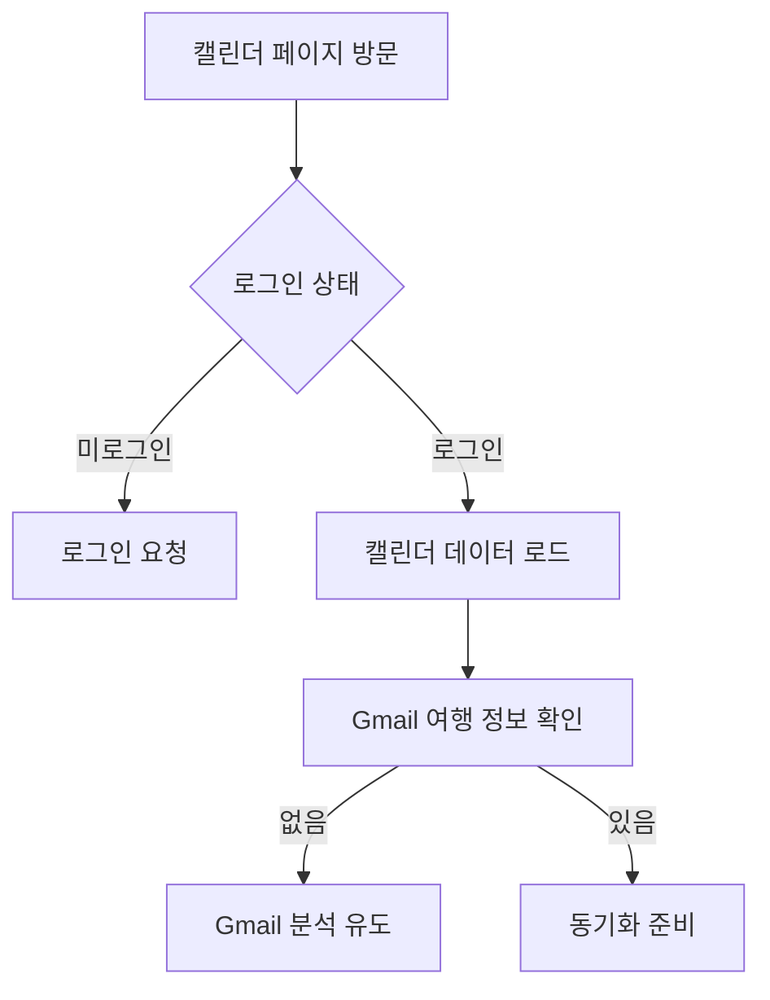
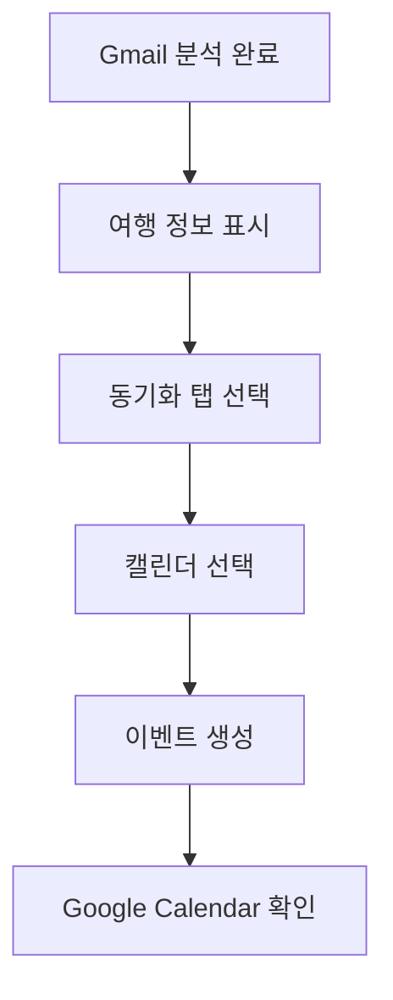

# 여행 캘린더 (/calendar)

## 개요

여행 일정을 캘린더 뷰로 시각화하고 Gmail 연동으로 추출한 여행 정보를 Google Calendar와 동기화하는 종합 캘린더 관리 시스템입니다.

### 주요 기능

- 여행 일정 캘린더 뷰
- Gmail 여행 정보 자동 동기화
- Google Calendar 통합
- 체류 기간 시각화
- 여행 통계 대시보드
- 5개 탭 구성 (일정, 개요, 동기화, 시각화, 관리)

## 사용자 역할 및 플로우

### 1. 초기 사용자 플로우



### 2. 동기화 플로우



## UI/UX 요소

### 1. 페이지 구조

```typescript
CalendarPage
├── PageHeader (제목, 설명)
├── Action Button (Google Calendar 열기)
├── Statistics Cards (4개)
│   ├── 전체 이벤트
│   ├── 예정된 여행
│   ├── 지난 여행
│   └── Gmail 분석
├── Tab Navigation (5개 탭)
└── Tab Content
    ├── 일정 (TravelCalendarView)
    ├── 개요 (Overview)
    ├── 동기화 (CalendarSync)
    ├── 시각화 (StayVisualizationCalendar)
    └── 관리 (Settings)
```

### 2. 통계 카드

- **전체 이벤트**: 캘린더의 총 이벤트 수
- **예정된 여행**: 미래 여행 일정 수
- **지난 여행**: 과거 여행 기록 수
- **Gmail 분석**: 분석된 여행 이메일 수

### 3. 탭별 기능

#### 📅 일정 탭

- 월별 캘린더 뷰
- 여행 이벤트 표시
- 클릭 가능한 이벤트
- 날짜별 여행 정보

#### 👁️ 개요 탭

- Google Calendar 통합 설명
- 지원 기능 목록
- 사용 방법 가이드
- 분석된 여행 정보 미리보기

#### 🔄 동기화 탭

- Gmail 여행 정보 목록
- 선택적 동기화
- 캘린더 선택 옵션
- 동기화 상태 표시

#### 📊 시각화 탭

- 체류 기간 히트맵
- 국가별 방문 빈도
- 여행 패턴 분석

#### ⚙️ 관리 탭

- Google Calendar 연결 상태
- 동기화 내역
- 캘린더 설정 링크

## 기술 구현

### 1. 상태 관리

```typescript
const [travelInfos, setTravelInfos] = useState<TravelInfo[]>([]);
const [trips, setTrips] = useState<Trip[]>([]);
const [calendarStats, setCalendarStats] = useState<CalendarStats>({
  totalEvents: 0,
  upcomingEvents: 0,
  pastEvents: 0,
});
const [activeTab, setActiveTab] = useState<TabType>('schedule');
```

### 2. API 통합

```typescript
// Gmail 여행 정보 로드
GET / api / gmail / analyze;

// 캘린더 통계 확인
GET / api / calendar / check;

// 여행 기록 로드
GET / api / trips;
```

### 3. 데이터 구조

```typescript
interface CalendarStats {
  totalEvents: number;
  upcomingEvents: number;
  pastEvents: number;
  lastSyncDate?: string;
}

interface TravelInfo {
  emailId: string;
  subject: string;
  confidence: number;
  departureDate?: string;
  destination?: string;
  hotelName?: string;
}
```

### 4. 컴포넌트 통합

- `TravelCalendarView`: 메인 캘린더 뷰
- `CalendarSync`: Gmail 동기화 기능
- `StayVisualizationCalendar`: 체류 시각화

## 성능 지표

### 1. 데이터 로딩 최적화

- 병렬 API 호출 (Gmail, Calendar, Trips)
- 조건부 데이터 로딩
- 에러 핸들링

### 2. UI 최적화

- 탭 lazy loading
- 컴포넌트 분할
- 상태 캐싱

## 모바일 지원

### 1. 반응형 디자인

- 모바일: 단일 열 레이아웃
- 태블릿: 2열 그리드
- 데스크톱: 4열 통계 카드

### 2. 터치 최적화

- 스크롤 가능한 탭
- 터치 친화적 이벤트
- 모바일 캘린더 뷰

## 알려진 이슈

### 1. Google Calendar API 구현 📋 구현 가이드 추가

- ~~문제: 실제 Calendar API 연동 미구현~~
- ~~영향: 동기화 기능 제한적~~
- **추가됨**: Google Calendar API 완전 통합 가이드

#### 실제 구현 방법

```bash
# 1. 패키지 설치 (Gmail API와 동일)
npm install googleapis google-auth-library

# 2. Google Cloud Console 설정
# - Calendar API 활성화
# - OAuth 2.0 스코프에 calendar 권한 추가
```

```typescript
// lib/calendar-service.ts
import { google } from 'googleapis';
import { OAuth2Client } from 'google-auth-library';

export class CalendarService {
  private oauth2Client: OAuth2Client;

  constructor() {
    this.oauth2Client = new google.auth.OAuth2(
      process.env.GOOGLE_CLIENT_ID,
      process.env.GOOGLE_CLIENT_SECRET,
      process.env.NEXTAUTH_URL + '/api/auth/callback/google'
    );
  }

  async createTravelEvent(
    accessToken: string,
    travelInfo: TravelInfo,
    calendarId: string = 'primary'
  ) {
    this.oauth2Client.setCredentials({ access_token: accessToken });
    const calendar = google.calendar({
      version: 'v3',
      auth: this.oauth2Client,
    });

    const event = {
      summary: `✈️ ${travelInfo.destination} 여행`,
      description: `
        🛫 출발: ${travelInfo.departure}
        🛬 목적지: ${travelInfo.destination}
        ${travelInfo.flightNumber ? `✈️ 항공편: ${travelInfo.flightNumber}` : ''}
        ${travelInfo.hotelName ? `🏨 숙소: ${travelInfo.hotelName}` : ''}
        ${travelInfo.bookingReference ? `📋 예약번호: ${travelInfo.bookingReference}` : ''}
        
        🤖 DINO에서 자동 생성된 일정
      `,
      start: {
        dateTime: new Date(travelInfo.departureDate).toISOString(),
        timeZone: 'Asia/Seoul',
      },
      end: {
        dateTime: travelInfo.returnDate
          ? new Date(travelInfo.returnDate).toISOString()
          : new Date(
              new Date(travelInfo.departureDate).getTime() + 24 * 60 * 60 * 1000
            ).toISOString(),
        timeZone: 'Asia/Seoul',
      },
      location: travelInfo.destination,
      colorId: '11', // 빨간색 (여행용)
      extendedProperties: {
        private: {
          dinoTravelId: travelInfo.emailId,
          dinoSource: 'gmail',
          dinoConfidence: travelInfo.confidence.toString(),
        },
      },
    };

    const response = await calendar.events.insert({
      calendarId,
      requestBody: event,
    });

    return response.data;
  }

  async syncMultipleTravels(
    accessToken: string,
    travelInfos: TravelInfo[],
    calendarId: string = 'primary'
  ) {
    // 기존 DINO 이벤트 조회
    const existingEvents = await this.getDinoEvents(accessToken, calendarId);

    // 중복 제거 및 새 이벤트만 생성
    const newTravels = travelInfos.filter(
      travel =>
        !existingEvents.some(
          event =>
            event.extendedProperties?.private?.dinoTravelId === travel.emailId
        )
    );

    // 병렬로 이벤트 생성
    const results = await Promise.all(
      newTravels.map(travel =>
        this.createTravelEvent(accessToken, travel, calendarId)
      )
    );

    return {
      created: results.length,
      skipped: travelInfos.length - results.length,
      events: results,
    };
  }

  private async getDinoEvents(accessToken: string, calendarId: string) {
    this.oauth2Client.setCredentials({ access_token: accessToken });
    const calendar = google.calendar({
      version: 'v3',
      auth: this.oauth2Client,
    });

    const response = await calendar.events.list({
      calendarId,
      privateExtendedProperty: 'dinoSource=gmail',
      timeMin: new Date(Date.now() - 365 * 24 * 60 * 60 * 1000).toISOString(), // 1년 전부터
      maxResults: 1000,
    });

    return response.data.items || [];
  }
}
```

```typescript
// app/api/calendar/sync/route.ts
import { CalendarService } from '@/lib/calendar-service';

export async function POST(request: Request) {
  const session = await getServerSession(authOptions);
  if (!session?.accessToken) {
    return NextResponse.json({ error: 'Unauthorized' }, { status: 401 });
  }

  const { travelInfos, calendarId } = await request.json();

  try {
    const calendarService = new CalendarService();
    const result = await calendarService.syncMultipleTravels(
      session.accessToken,
      travelInfos,
      calendarId
    );

    return NextResponse.json({
      success: true,
      ...result,
    });
  } catch (error) {
    return NextResponse.json(
      {
        success: false,
        error: error.message,
      },
      { status: 500 }
    );
  }
}
```

#### NextAuth 설정 업데이트

```typescript
// lib/auth.ts
export const authOptions: NextAuthOptions = {
  providers: [
    GoogleProvider({
      clientId: process.env.GOOGLE_CLIENT_ID!,
      clientSecret: process.env.GOOGLE_CLIENT_SECRET!,
      authorization: {
        params: {
          scope: [
            'openid',
            'email',
            'profile',
            'https://www.googleapis.com/auth/gmail.readonly',
            'https://www.googleapis.com/auth/calendar', // Calendar 권한 추가
          ].join(' '),
        },
      },
    }),
  ],
  callbacks: {
    async jwt({ token, account }) {
      if (account) {
        token.accessToken = account.access_token;
      }
      return token;
    },
    async session({ session, token }) {
      session.accessToken = token.accessToken;
      return session;
    },
  },
};
```

### 2. 실시간 동기화 부재

- 문제: 수동 동기화만 가능
- 해결: 웹훅 또는 주기적 동기화 구현

### 3. 이벤트 중복 처리

- 문제: 중복 이벤트 방지 로직 미흡
- 해결: 고유 ID 기반 중복 체크 필요

## 개선 계획

### 단기 (1-2주)

1. Google Calendar API 완전 통합
2. 이벤트 중복 방지 로직
3. 동기화 상태 저장
4. 에러 메시지 개선

### 중기 (1개월)

1. 실시간 동기화
2. 다중 캘린더 지원
3. 이벤트 편집 기능
4. 알림 설정

### 장기 (3개월)

1. 다른 캘린더 서비스 지원
2. 팀 캘린더 공유
3. 여행 일정 최적화
4. AI 일정 추천

## SEO/메타데이터

### 메타 태그

```html
<title>여행 캘린더 - DINO | Gmail 연동 여행 일정 관리</title>
<meta
  name="description"
  content="Gmail에서 자동으로 추출한 여행 정보를 캘린더로 관리하고 Google Calendar와 동기화하세요."
/>
<meta
  name="keywords"
  content="여행캘린더, 일정관리, Gmail동기화, Google Calendar"
/>
```

## 보안 고려사항

### 1. OAuth 권한 관리

- Google Calendar 최소 권한
- 사용자별 토큰 관리
- 안전한 토큰 저장

### 2. 데이터 보호

- 캘린더 데이터 암호화
- 사용자간 데이터 격리
- 민감 정보 필터링

### 3. API 보안

- Rate limiting
- 인증 검증
- CORS 설정

## 사용자 분석

### 추적 이벤트

1. 탭 전환
2. 동기화 실행
3. 캘린더 이벤트 클릭
4. Google Calendar 열기
5. 에러 발생

### 주요 지표

- 활성 탭 사용률
- 동기화 성공률
- 평균 이벤트 수
- 사용자당 여행 수
- 기능별 사용 시간

## 통합 기능 상세

### Gmail 통합

- 여행 이메일 자동 분석
- 신뢰도 기반 필터링
- 일괄 동기화 지원

### Google Calendar 통합

- OAuth 2.0 인증
- 이벤트 CRUD 작업
- 실시간 업데이트

### 여행 기록 연동

- 기존 여행 데이터 표시
- 캘린더와 양방향 동기화
- 통합 통계 제공

## 관련 컴포넌트

- `components/calendar/TravelCalendarView.tsx` - 메인 캘린더 뷰
- `components/calendar/CalendarSync.tsx` - 동기화 인터페이스
- `components/calendar/StayVisualizationCalendar.tsx` - 체류 시각화
- `components/common/PageHeader.tsx` - 페이지 헤더
- `components/ui/HydrationSafeLoading.tsx` - 로딩 컴포넌트

## 관련 문서

- [Gmail 통합](./gmail.md) - 여행 정보 소스
- [여행 기록](./trips.md) - 여행 데이터 관리
- [대시보드](./dashboard.md) - 통합 뷰
- [API 문서](../api/calendar.md) - Calendar API 상세
