# Gmail 통합 (/gmail)

## 개요

Gmail에서 여행 관련 이메일을 자동으로 분석하여 여행 정보를 추출하고 관리하는 기능입니다. 항공권, 호텔 예약, 여행 일정 등을 자동으로 인식합니다.

### 주요 기능

- Gmail OAuth 연동
- 여행 이메일 자동 분석
- 여행 정보 추출 (날짜, 목적지, 예약번호 등)
- 신뢰도 기반 필터링
- 여행 기록으로 자동 추가
- 개인정보 보호 안내

## 사용자 역할 및 플로우

### 1. 초기 연동 플로우

```mermaid
graph TD
    A[Gmail 페이지 방문] --> B{로그인 상태}
    B -->|미로그인| C[로그인 요청]
    B -->|로그인| D[Gmail 연결 상태 확인]
    D -->|미연결| E[OAuth 연동 안내]
    D -->|연결됨| F[이메일 분석 준비]
    F --> G[분석 버튼 표시]
```



### 2. 이메일 분석 플로우

```mermaid
graph TD
    A[분석 시작] --> B[이메일 스캔]
    B --> C[여행 패턴 인식]
    C --> D[정보 추출]
    D --> E{신뢰도 검증}
    E -->|높음| F[여행 정보 표시]
    E -->|낮음| G[제외]
    F --> H[여행 기록 추가 옵션]
```



## UI/UX 요소

### 1. 페이지 구조

```typescript
GmailPage
├── PageHeader (제목, 설명, 액션 버튼)
├── WireframeGmailIntegration (메인 컴포넌트)
│   ├── 연결 상태 섹션
│   │   ├── 상태 표시 (연결/미연결)
│   │   └── 연결 확인 버튼
│   ├── 이메일 분석 컨트롤
│   │   ├── 최근 10개 분석
│   │   ├── 최근 20개 분석
│   │   └── 전체 분석 (50개)
│   ├── 분석 결과 탭
│   │   ├── 분석결과 탭
│   │   └── 통계 탭
│   └── 개별 이메일 카드
├── 사용 가이드
└── 개인정보 보호 안내
```

### 2. 연결 상태 표시

```typescript
// 연결 상태 UI
- 초록색 점 + "Gmail 연결됨" (연결)
- 빨간색 점 + "연결 확인 실패" (미연결)
- 파란색 "연결 상태 확인" 버튼
```

### 3. 분석 버튼 그룹

- **최근 10개 분석**: 빠른 확인용 (초록색)
- **최근 20개 분석**: 일반 분석 (파란색)
- **전체 분석 (50개)**: 종합 분석 (보라색)

### 4. 이메일 카드 구성

```typescript
EmailCard
├── 제목 (이메일 제목)
├── 발신자
├── 카테고리 뱃지 (항공사/호텔/여행사/렌터카/예약사이트)
├── 신뢰도 표시 (70%+ 초록, 50-70% 노란, 50%- 빨강)
├── 여행 정보
│   ├── ✈️ 출발일
│   ├── 🏠 귀국일
│   ├── 📍 출발지
│   ├── 🎯 목적지
│   ├── ✈️ 항공편
│   └── 📋 예약번호
└── "여행 기록 추가" 버튼 (신뢰도 50% 이상)
```

### 5. 사용 가이드 섹션

1. Gmail 연결 확인
2. 여행 이메일 분석
3. 분석 결과 확인
4. 지원하는 이메일 유형

## 기술 구현

### 1. 상태 관리

```typescript
interface GmailConnectionStatus {
  connected: boolean;
  email?: string;
  lastSync?: string;
  permissions: string[];
  error?: string;
}

interface TravelEmail {
  emailId: string;
  subject: string;
  from: string;
  date: string;
  category:
    | 'airline'
    | 'hotel'
    | 'travel_agency'
    | 'rental'
    | 'booking_platform';
  confidence: number; // 0-1
  extractedInfo: {
    departureDate?: string;
    returnDate?: string;
    departure?: string;
    destination?: string;
    flightNumber?: string;
    bookingReference?: string;
    hotelName?: string;
    confirmationCode?: string;
  };
}

const [connectionStatus, setConnectionStatus] =
  useState<GmailConnectionStatus | null>(null);
const [travelEmails, setTravelEmails] = useState<TravelEmail[]>([]);
const [isLoading, setIsLoading] = useState(false);
const [error, setError] = useState<string>('');
const [activeTab, setActiveTab] = useState<'analysis' | 'stats'>('analysis');
```

### 2. API 통합

```typescript
// Gmail 연결 확인
GET /api/gmail/check

// 여행 이메일 분석
GET /api/gmail/analyze?maxResults={number}
```

### 3. API 응답 구조

```typescript
interface GmailAnalyzeResponse {
  success: boolean;
  totalAnalyzed: number;
  emailsFound: number;
  travelEmails: TravelEmail[];
  statistics: {
    categoryBreakdown: Record<string, number>;
    averageConfidence: number;
    dateRange: {
      earliest: string;
      latest: string;
    };
  };
  error?: string;
}

interface GmailCheckResponse {
  success: boolean;
  connected: boolean;
  email?: string;
  permissions: string[];
  lastSync?: string;
  error?: string;
}
```

### 4. 카테고리 분류

- **airline**: 항공사
- **hotel**: 호텔
- **travel_agency**: 여행사
- **rental**: 렌터카
- **booking_platform**: 예약사이트

## 성능 지표

### 1. API 호출 최적화

- 연결 상태 캐싱
- 분석 결과 로컬 저장
- 점진적 로딩 (10→20→50)

### 2. UI 응답성

- 로딩 상태 표시
- 에러 핸들링
- 버튼 비활성화 처리

## 모바일 지원

### 1. 반응형 디자인

- 이메일 카드 세로 스택
- 터치 친화적 버튼 크기
- 스크롤 가능한 결과 목록

### 2. 모바일 최적화

- 간소화된 정보 표시
- 스와이프 제스처 준비
- 최적화된 이미지 크기

## 알려진 이슈

### 1. Gmail OAuth 구현 📋 구현 가이드 추가

- ~~문제: 실제 Gmail API 연동 미완성~~
- ~~현재: 목업 데이터 사용~~
- **추가됨**: googleapis 라이브러리 실제 구현 가이드

#### 실제 구현 방법

```bash
# 1. 필요한 패키지 설치
npm install googleapis google-auth-library

# 2. Google Cloud Console 설정
# - Gmail API 활성화
# - OAuth 2.0 클라이언트 ID 생성
# - 승인된 리디렉션 URI 설정
```

```typescript
// lib/gmail-client.ts
import { google } from 'googleapis';
import { OAuth2Client } from 'google-auth-library';

export class GmailService {
  private oauth2Client: OAuth2Client;

  constructor() {
    this.oauth2Client = new google.auth.OAuth2(
      process.env.GOOGLE_CLIENT_ID,
      process.env.GOOGLE_CLIENT_SECRET,
      process.env.NEXTAUTH_URL + '/api/auth/callback/google'
    );
  }

  async searchTravelEmails(
    accessToken: string,
    maxResults: number = 20
  ): Promise<TravelEmail[]> {
    this.oauth2Client.setCredentials({ access_token: accessToken });
    const gmail = google.gmail({ version: 'v1', auth: this.oauth2Client });

    // 여행 관련 키워드로 검색
    const query =
      'from:(airline.com OR booking.com OR hotels.com OR expedia.com) OR subject:(flight OR hotel OR booking OR confirmation)';

    const response = await gmail.users.messages.list({
      userId: 'me',
      q: query,
      maxResults,
    });

    // 메시지 상세 정보 가져오기 및 분석
    const emails = await Promise.all(
      (response.data.messages || []).map(async message => {
        const detail = await gmail.users.messages.get({
          userId: 'me',
          id: message.id!,
        });

        return this.extractTravelInfo(detail.data);
      })
    );

    return emails.filter(email => email.confidence > 0.5);
  }

  private extractTravelInfo(message: any): TravelEmail {
    // AI/ML 기반 이메일 분석 로직
    // 정규식, 키워드 매칭, 구조화된 데이터 추출
    // 신뢰도 계산
  }
}
```

```typescript
// app/api/gmail/analyze/route.ts
import { GmailService } from '@/lib/gmail-client';

export async function GET(request: Request) {
  const session = await getServerSession(authOptions);
  if (!session?.accessToken) {
    return NextResponse.json({ error: 'Unauthorized' }, { status: 401 });
  }

  const { searchParams } = new URL(request.url);
  const maxResults = parseInt(searchParams.get('maxResults') || '20');

  try {
    const gmailService = new GmailService();
    const travelEmails = await gmailService.searchTravelEmails(
      session.accessToken,
      maxResults
    );

    return NextResponse.json({
      success: true,
      totalAnalyzed: maxResults,
      emailsFound: travelEmails.length,
      travelEmails,
    });
  } catch (error) {
    return NextResponse.json(
      {
        success: false,
        error: error.message,
      },
      { status: 500 }
    );
  }
}
```

### 2. 타입 안정성 ✅ 해결됨

- ~~문제: any 타입 사용 다수~~
- ~~영향: 타입 안정성 부족~~
- ~~해결: 명확한 인터페이스 정의 필요~~
- **완료**: GmailConnectionStatus, TravelEmail, API 응답 타입들 정의

### 3. 에러 처리

- 문제: 상세한 에러 메시지 부족
- 해결: 사용자 친화적 에러 메시지 추가

### 4. 통계 탭 미구현

- 문제: 통계 탭 UI만 존재
- 해결: 실제 통계 데이터 표시 구현

## 개선 계획

### 단기 (1-2주)

1. 실제 Gmail API 연동 완성
2. 타입 정의 강화
3. 통계 탭 구현
4. 이메일 필터링 옵션

### 중기 (1개월)

1. 더 많은 이메일 유형 지원
2. 다국어 이메일 분석
3. 일괄 여행 기록 추가
4. 분석 정확도 향상

### 장기 (3개월)

1. AI 기반 패턴 학습
2. 실시간 이메일 모니터링
3. 다른 이메일 서비스 지원
4. 여행 일정 자동 생성

## 보안 고려사항

### 1. OAuth 권한

- 읽기 전용 권한만 요청
- 최소 필요 스코프 사용
- 토큰 안전 저장

### 2. 데이터 처리

- 이메일 내용 로컬 처리
- 민감 정보 필터링
- 서버 전송 최소화

### 3. 사용자 동의

- 명시적 권한 요청
- 데이터 사용 범위 공개
- 언제든 연동 해제 가능

## 사용자 분석

### 추적 이벤트

1. Gmail 연결 시도
2. 연결 성공/실패
3. 분석 실행 (개수별)
4. 여행 기록 추가
5. 에러 발생

### 주요 지표

- 연결 성공률
- 평균 분석 이메일 수
- 여행 정보 추출률
- 신뢰도 분포
- 카테고리별 이메일 비율

## 개인정보 보호

### 보호 원칙

1. 이메일 내용은 로컬에서만 처리
2. 읽기 전용 권한만 사용
3. 분석된 정보는 사용자 승인 후 저장
4. 언제든지 Gmail 연동 해제 가능

### 데이터 보관

- 임시 데이터만 메모리 저장
- 영구 저장은 사용자 확인 후
- 연동 해제 시 모든 데이터 삭제

## 지원 이메일 유형

### 현재 지원

- 항공권 예약 이메일 (항공사, 여행사)
- 호텔 예약 이메일 (Booking.com, Expedia, Agoda 등)
- 렌터카 예약 이메일
- 여행 일정 이메일
- 전자티켓 및 보딩패스

### 계획 중

- 기차/버스 티켓
- 투어/액티비티 예약
- 여행 보험
- 비자 관련 이메일

## 관련 컴포넌트

- `components/common/PageHeader.tsx` - 페이지 헤더
- `app/api/gmail/check/route.ts` - Gmail 연결 확인 API
- `app/api/gmail/analyze/route.ts` - 이메일 분석 API

## 관련 문서

- [여행 기록](./trips.md) - 분석된 정보 저장처
- [대시보드](./dashboard.md) - Gmail 연동 상태 표시
- [API 문서](../api/gmail.md) - Gmail API 상세
