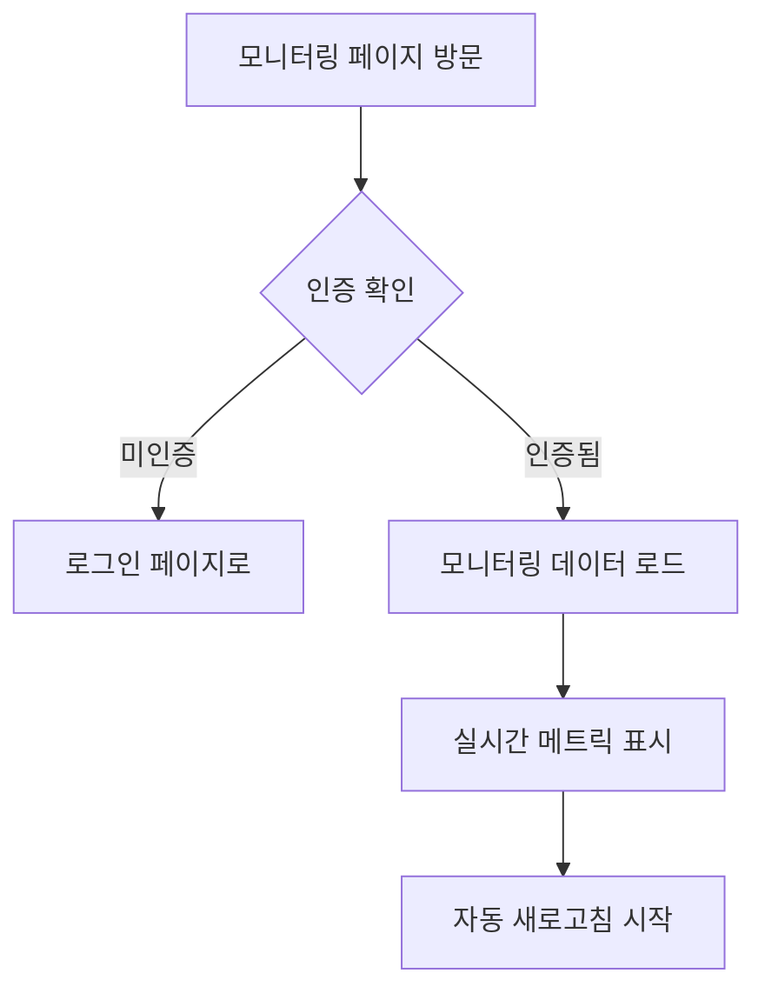
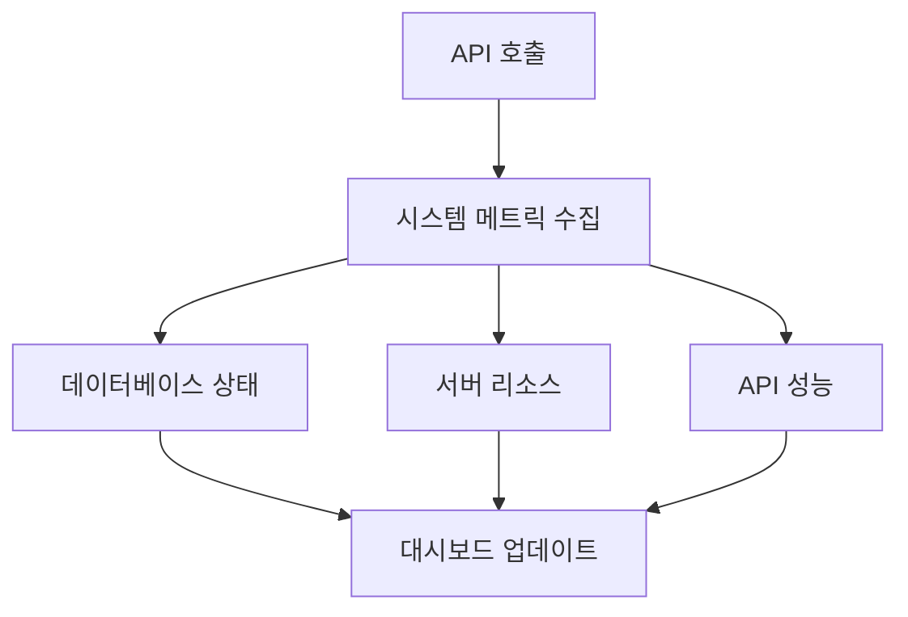

# 시스템 모니터링 (/monitoring)

## 개요

실시간 시스템 성능 모니터링 대시보드로, 서버 상태, 데이터베이스 성능, API 응답 시간 등을 종합적으로 모니터링합니다.

### 주요 기능

- 실시간 시스템 메트릭 모니터링
- 데이터베이스 성능 추적
- CPU/메모리 사용률 차트
- 자동 새로고침 (30초)
- 시간 범위 선택 (1시간/24시간/7일)
- 성능 이상 감지 및 경고

## 사용자 역할 및 플로우

### 1. 모니터링 접근 플로우



### 2. 데이터 흐름



## UI/UX 요소

### 1. 페이지 구조

```typescript
MonitoringPage
├── PageHeader (제목, 설명, 액션 버튼)
├── Control Panel
│   ├── Time Range Selector
│   ├── Auto Refresh Toggle
│   └── Manual Refresh Button
├── Status Overview (6 메트릭 카드)
│   ├── System Status
│   ├── Database Latency
│   ├── CPU Usage
│   ├── Memory Usage
│   ├── Query Performance
│   └── Error Rate
├── Charts Section
│   ├── CPU/Memory Charts
│   └── Database Charts
└── Detailed Information (3 카드)
    ├── Database Status
    ├── System Information
    └── Performance Summary
```

### 2. 메트릭 카드 시스템

```typescript
interface MetricCard {
  title: string;
  value: number | string;
  unit?: string;
  status: 'good' | 'warning' | 'error';
  description?: string;
}
```

**상태별 색상 코드:**

- 🟢 Good (초록): 정상 범위
- 🟡 Warning (노랑): 주의 필요
- 🔴 Error (빨강): 즉시 조치 필요

### 3. 성능 임계값

- **CPU**: <70% (Good), 70-90% (Warning), >90% (Error)
- **Memory**: <70% (Good), 70-85% (Warning), >85% (Error)
- **DB Latency**: <100ms (Good), 100-500ms (Warning), >500ms (Error)
- **Query Duration**: <100ms (Good), 100-500ms (Warning), >500ms (Error)

### 4. 차트 시각화

- **SimpleChart 컴포넌트**: 최근 20개 데이터 포인트
- **동적 색상**: 임계값 기반 막대 색상 변경
- **실시간 업데이트**: 30초마다 새 데이터 추가

## 기술 구현

### 1. 상태 관리

```typescript
interface SystemMetrics {
  timestamp: number;
  cpu: { usage: number; loadAverage: number[] };
  memory: { used: number; total: number; usage: number };
  database: {
    activeConnections: number;
    queryLatency: number;
    errorRate: number;
  };
  api: {
    requestCount: number;
    errorCount: number;
    averageResponseTime: number;
  };
  users: { activeUsers: number; totalUsers: number; newUsers: number };
}

interface MonitoringData {
  current: SystemMetrics | null;
  database: DatabaseMetrics;
  system: SystemInfo;
  history?: SystemMetrics[];
}
```

### 2. API 통합

```typescript
// 모니터링 메트릭 가져오기
GET /api/monitoring/metrics?timeRange={1h|24h|7d}&history=true
```

### 3. 자동 새로고침

```typescript
useEffect(() => {
  if (!autoRefresh) return;

  const interval = setInterval(() => {
    loadMonitoringData();
  }, 30000); // 30초

  return () => clearInterval(interval);
}, [autoRefresh]);
```

### 4. 유틸리티 함수

- `formatUptime()`: 업타임을 읽기 쉬운 형식으로 변환
- `formatBytes()`: 바이트를 KB/MB/GB로 변환
- `getStatusColor()`: 상태에 따른 색상 결정

## 성능 지표

### 1. 데이터 최적화

- 히스토리 데이터 제한 (최근 20개)
- 조건부 렌더링
- 메모이제이션 활용

### 2. 네트워크 최적화

- 시간 범위별 데이터 요청
- 에러 시 재시도 로직
- 로딩 상태 관리

## 모바일 지원

### 1. 반응형 그리드

- 모바일: 1열
- 태블릿: 2열
- 데스크톱: 6열 (상태 카드)

### 2. 터치 최적화

- 큰 터치 타겟
- 스크롤 가능한 차트
- 간소화된 모바일 뷰

## 알려진 이슈

### 1. 실시간 데이터 지연

- 문제: 30초 갱신 주기로 인한 지연
- 해결: WebSocket 실시간 연결 구현

### 2. 히스토리 데이터 제한

- 문제: 메모리 제약으로 20개만 표시
- 해결: 페이지네이션 또는 가상화 구현

### 3. 에러 상세 정보 부족

- 문제: 에러 발생 시 상세 정보 미제공
- 해결: 에러 로그 뷰어 추가

## 개선 계획

### 단기 (1-2주)

1. WebSocket 실시간 업데이트
2. 알림 시스템 (임계값 초과 시)
3. 에러 로그 상세 뷰
4. 메트릭 내보내기 기능

### 중기 (1개월)

1. 커스텀 대시보드
2. 성능 예측 분석
3. 다중 서버 모니터링
4. 모바일 앱 푸시 알림

### 장기 (3개월)

1. AI 기반 이상 감지
2. 자동 스케일링 제안
3. 성능 최적화 추천
4. 통합 로그 분석

## 보안 고려사항

### 1. 접근 제어

- 인증된 사용자만 접근
- 역할 기반 권한 (향후)
- 감사 로그

### 2. 데이터 보안

- 민감 정보 마스킹
- HTTPS 전송
- 로그 데이터 암호화

### 3. API 보안

- Rate limiting
- 인증 토큰 검증
- 비정상 패턴 감지

## 사용자 분석

### 추적 이벤트

1. 페이지 방문
2. 시간 범위 변경
3. 자동 새로고침 토글
4. 수동 새로고침
5. 에러 발생

### 주요 지표

- 평균 모니터링 시간
- 가장 많이 본 메트릭
- 알림 응답 시간
- 시간대별 사용 패턴

## 차트 시스템 상세

### SimpleChart 컴포넌트

- **목적**: 간단한 막대 차트로 시계열 데이터 표시
- **특징**:
  - 동적 높이 계산
  - 임계값 기반 색상
  - 현재값/최대값 표시
  - 반응형 디자인

### 지원 차트 유형

1. **CPU Usage**: 시간별 CPU 사용률
2. **Memory Usage**: 메모리 사용 추이
3. **Database Latency**: DB 응답 시간
4. **Active Connections**: 활성 연결 수

## 시스템 정보 표시

### Database Status

- Health: 전반적 상태
- Latency: 평균 응답 시간
- Connections: 활성/최대 연결
- Pool Status: 연결 풀 상태
- Query Cache: 캐시 항목 수
- Slow Queries: 느린 쿼리 수

### System Information

- Environment: 실행 환경
- Uptime: 서버 가동 시간
- Node Version: Node.js 버전
- Memory: 힙 사용량 상세

### Performance Summary

- Total Queries: 총 쿼리 수
- Average Duration: 평균 실행 시간
- Error Queries: 오류 쿼리 수
- Cache Hit Rate: 캐시 적중률

## 관련 컴포넌트

- `components/common/PageHeader.tsx` - 페이지 헤더
- `lib/api-client.ts` - API 통신
- `app/api/monitoring/metrics/route.ts` - 모니터링 API

## 관련 문서

- [대시보드](./dashboard.md) - 메인 대시보드
- [관리자 모니터링](./admin/monitoring.md) - 관리자 전용
- [API 문서](../api/monitoring.md) - 모니터링 API
- [성능 가이드](../guides/performance.md) - 성능 최적화
