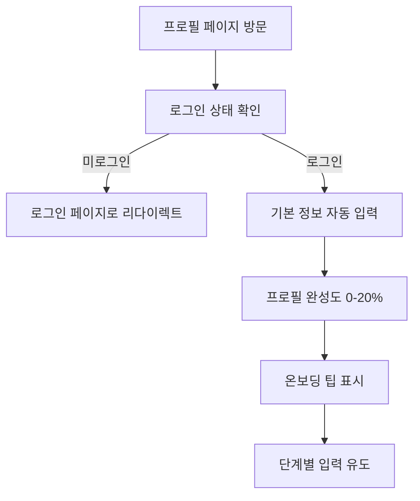
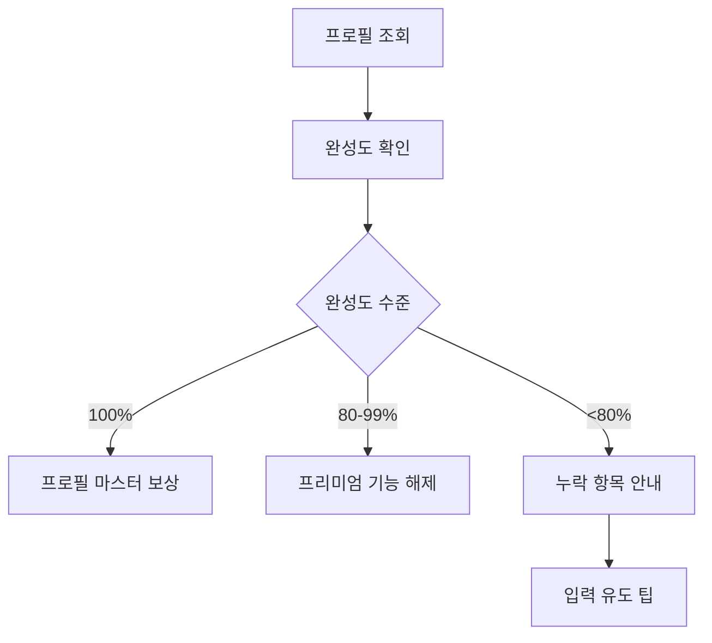

# 프로필 (/profile)

## 개요

사용자 프로필 관리 페이지로, 개인 정보와 여행 선호도를 설정하고 프로필 완성도를 게임화하여 사용자 참여를 유도합니다.

### 주요 기능

- 프로필 정보 관리 (이름, 거주지, 국적 등)
- 여행 선호도 설정 (스타일, 동반 유형)
- 비자 정보 관리 (여권 정보)
- 프로필 완성도 게임화
- 보상 시스템과 진행률 추적
- 모바일 최적화 UI

## 사용자 역할 및 플로우

### 1. 신규 사용자 플로우



### 2. 기존 사용자 플로우



## UI/UX 요소

### 1. 페이지 구조

```typescript
ProfilePage
├── Header (설정으로 돌아가기, 편집/저장 버튼)
├── PageHeader (제목, 설명)
├── 프로필 완성도 카드 (게임화 요소)
│   ├── 완성도 퍼센트
│   ├── 보상 레벨 (🌱→⭐→🥉→🥈→🏆)
│   ├── 프로그레스 바
│   ├── 완성 뱃지들
│   └── 보상 시스템 설명
├── 프로필 카드 (왼쪽)
│   ├── 프로필 이미지
│   ├── 이름/이메일
│   ├── 자기소개
│   └── 위치/국적 아이콘
└── 상세 정보 카드들 (오른쪽)
    ├── 기본 정보
    ├── 여행 선호도
    └── 비자 정보
```

### 2. 프로필 완성도 시스템

**보상 레벨:**

- 🌱 0-39%: 기본 기능 사용
- ⭐ 40-59%: 개인화된 여행 추천
- 🥉 60-79%: 고급 통계 및 인사이트
- 🥈 80-99%: AI 여행 어시스턴트 활성화
- 🏆 100%: 프리미엄 기능 모두 해제!

### 3. 게임화 요소

- **진행률 바**: 동적 색상 변경 (파란색→동색→은색→금색)
- **섹션별 완성 뱃지**: ✅ 기본정보, ✅ 개인정보, ✅ 여행스타일, ✅ 비자정보
- **실시간 팁**: 다음 입력할 항목 제안
- **보상 미리보기**: 완성 시 얻을 혜택 표시

### 4. 입력 필드 우선순위

```typescript
// 필수 항목 (⚠️ 표시)
- 이름
- 거주지
- 국적
- 여권 발급국
- 여권 만료일

// 추천 항목 (💬 표시)
- 자기소개
```

### 5. 여권 만료일 경고

- 180일 미만 남음: 빨간색 경고 표시
- 실시간 남은 일수 계산

## 기술 구현

### 1. 상태 관리

```typescript
interface UserProfile {
  name: string;
  email: string;
  bio: string;
  location: string;
  nationality: string;
  dateOfBirth: string;
  travelPreferences: {
    favoriteCountries: string[];
    travelStyle: 'budget' | 'comfort' | 'luxury';
    groupSize: 'solo' | 'couple' | 'group';
  };
  visaInfo: {
    passportCountry: string;
    passportExpiry: string;
    preferredLanguage: string;
  };
}
```

### 2. 데이터 저장

- NextAuth 세션에서 기본 정보 로드
- localStorage에 추가 프로필 정보 저장
- 클라이언트 사이드 저장 (서버 API 미구현)

### 3. 완성도 계산 로직

```typescript
const calculateCompletion = () => {
  const fields = [
    profile.name,
    profile.email,
    profile.bio,
    profile.location,
    profile.nationality,
    profile.travelPreferences.travelStyle,
    profile.travelPreferences.groupSize,
    profile.visaInfo.passportCountry,
    profile.visaInfo.passportExpiry,
  ];

  const filledFields = fields.filter(field => field && field.length > 0).length;
  return Math.round((filledFields / fields.length) * 100);
};
```

### 4. 편집 모드 토글

- 읽기 모드: 정보 표시
- 편집 모드: 입력 필드 활성화
- 저장 시 로컬스토리지 업데이트

## 성능 지표

### 1. 최적화 전략

- 프로필 이미지 lazy loading
- 상태 변경 시 부분 렌더링
- localStorage 캐싱

### 2. 로딩 최적화

- NextAuth 세션 캐싱
- 조건부 렌더링으로 깜빡임 방지

## 모바일 지원

### 1. 반응형 레이아웃

- 모바일: 세로 스택 레이아웃
- 태블릿: 2열 그리드
- 데스크톱: 3열 프로필+상세정보

### 2. 터치 최적화

- 큰 터치 타겟 (최소 44px)
- 스크롤 가능한 카드
- 모바일 친화적 입력 필드

## 알려진 이슈

### 1. 데이터 저장 방식 📋 서버 API 구현 가이드 추가

- ~~문제: localStorage만 사용 (서버 동기화 없음)~~
- ~~영향: 디바이스 간 동기화 불가~~
- **추가됨**: 서버 사이드 API 구현 가이드

#### 서버 API 구현 방법

```typescript
// app/api/profile/route.ts
import { getServerSession } from 'next-auth';
import { NextResponse } from 'next/server';
import { authOptions } from '@/lib/auth';
import { PrismaClient } from '@prisma/client';

const prisma = new PrismaClient();

// 프로필 조회
export async function GET() {
  const session = await getServerSession(authOptions);
  if (!session?.user?.email) {
    return NextResponse.json({ error: 'Unauthorized' }, { status: 401 });
  }

  try {
    const profile = await prisma.userProfile.findUnique({
      where: { email: session.user.email },
    });

    if (!profile) {
      // 기본 프로필 생성
      const newProfile = await prisma.userProfile.create({
        data: {
          email: session.user.email,
          name: session.user.name || '',
          bio: '',
          location: '',
          nationality: '',
          dateOfBirth: null,
          travelPreferences: {
            favoriteCountries: [],
            travelStyle: 'comfort',
            groupSize: 'solo',
          },
          visaInfo: {
            passportCountry: '',
            passportExpiry: '',
            preferredLanguage: 'ko',
          },
        },
      });
      return NextResponse.json(newProfile);
    }

    return NextResponse.json(profile);
  } catch (error) {
    return NextResponse.json(
      {
        error: 'Failed to fetch profile',
      },
      { status: 500 }
    );
  }
}

// 프로필 업데이트
export async function PUT(request: Request) {
  const session = await getServerSession(authOptions);
  if (!session?.user?.email) {
    return NextResponse.json({ error: 'Unauthorized' }, { status: 401 });
  }

  try {
    const profileData = await request.json();

    // 입력 검증
    const validatedData = validateProfileData(profileData);

    const updatedProfile = await prisma.userProfile.upsert({
      where: { email: session.user.email },
      update: {
        ...validatedData,
        updatedAt: new Date(),
      },
      create: {
        email: session.user.email,
        ...validatedData,
      },
    });

    return NextResponse.json(updatedProfile);
  } catch (error) {
    return NextResponse.json(
      {
        error: 'Failed to update profile',
      },
      { status: 500 }
    );
  }
}

function validateProfileData(data: any): Partial<UserProfile> {
  return {
    name: data.name?.trim() || '',
    bio: data.bio?.trim() || '',
    location: data.location?.trim() || '',
    nationality: data.nationality?.trim() || '',
    dateOfBirth: data.dateOfBirth ? new Date(data.dateOfBirth) : null,
    travelPreferences: {
      favoriteCountries: Array.isArray(
        data.travelPreferences?.favoriteCountries
      )
        ? data.travelPreferences.favoriteCountries
        : [],
      travelStyle: ['budget', 'comfort', 'luxury'].includes(
        data.travelPreferences?.travelStyle
      )
        ? data.travelPreferences.travelStyle
        : 'comfort',
      groupSize: ['solo', 'couple', 'group'].includes(
        data.travelPreferences?.groupSize
      )
        ? data.travelPreferences.groupSize
        : 'solo',
    },
    visaInfo: {
      passportCountry: data.visaInfo?.passportCountry?.trim() || '',
      passportExpiry: data.visaInfo?.passportExpiry?.trim() || '',
      preferredLanguage: data.visaInfo?.preferredLanguage || 'ko',
    },
  };
}
```

#### Prisma 스키마 추가

```prisma
// prisma/schema.prisma
model UserProfile {
  id        String   @id @default(cuid())
  email     String   @unique
  name      String
  bio       String   @default("")
  location  String   @default("")
  nationality String @default("")
  dateOfBirth DateTime?

  travelPreferences Json // TravelPreferences 타입
  visaInfo         Json // VisaInfo 타입

  createdAt DateTime @default(now())
  updatedAt DateTime @updatedAt

  @@map("user_profiles")
}
```

#### 클라이언트 사이드 훅

```typescript
// hooks/useProfile.ts
import { useState, useEffect } from 'react';
import { UserProfile } from '@/types/profile';

export function useProfile() {
  const [profile, setProfile] = useState<UserProfile | null>(null);
  const [loading, setLoading] = useState(true);
  const [error, setError] = useState<string | null>(null);

  useEffect(() => {
    fetchProfile();
  }, []);

  const fetchProfile = async () => {
    try {
      setLoading(true);
      const response = await fetch('/api/profile');
      if (!response.ok) throw new Error('Failed to fetch profile');

      const data = await response.json();
      setProfile(data);
    } catch (err) {
      setError(err instanceof Error ? err.message : 'Unknown error');
    } finally {
      setLoading(false);
    }
  };

  const updateProfile = async (updates: Partial<UserProfile>) => {
    try {
      setLoading(true);
      const response = await fetch('/api/profile', {
        method: 'PUT',
        headers: { 'Content-Type': 'application/json' },
        body: JSON.stringify(updates),
      });

      if (!response.ok) throw new Error('Failed to update profile');

      const updatedProfile = await response.json();
      setProfile(updatedProfile);
      return updatedProfile;
    } catch (err) {
      setError(err instanceof Error ? err.message : 'Unknown error');
      throw err;
    } finally {
      setLoading(false);
    }
  };

  return {
    profile,
    loading,
    error,
    updateProfile,
    refetch: fetchProfile,
  };
}
```

#### 데이터베이스 마이그레이션

```bash
# 1. 스키마 생성
npx prisma db push

# 2. 기존 localStorage 데이터 마이그레이션 스크립트
npx prisma generate
```

### 2. 프로필 이미지 업로드

- 문제: 이미지 업로드 기능 미구현
- 영향: Google 프로필 이미지만 사용 가능
- 해결: 이미지 업로드 API 필요

### 3. 타입 안정성 ✅ 해결됨

- ~~문제: 일부 any 타입 사용~~
- ~~해결: 엄격한 타입 정의 필요~~
- **완료**: 모든 사용자 프로필 데이터가 UserProfile 인터페이스로 타입 정의됨

## 🔒 보안 강화 - 여권 정보 암호화 시스템

### 암호화 구현 가이드

```bash
# 1. 암호화 라이브러리 설치
npm install crypto-js
npm install @types/crypto-js --save-dev
```

```typescript
// lib/encryption.ts
import CryptoJS from 'crypto-js';

class EncryptionService {
  private readonly secretKey: string;

  constructor() {
    this.secretKey = process.env.ENCRYPTION_SECRET_KEY!;
    if (!this.secretKey) {
      throw new Error('ENCRYPTION_SECRET_KEY environment variable is required');
    }
  }

  encryptSensitiveData(data: string): string {
    try {
      const encrypted = CryptoJS.AES.encrypt(data, this.secretKey).toString();
      return encrypted;
    } catch (error) {
      throw new Error('Failed to encrypt sensitive data');
    }
  }

  decryptSensitiveData(encryptedData: string): string {
    try {
      const decrypted = CryptoJS.AES.decrypt(encryptedData, this.secretKey);
      return decrypted.toString(CryptoJS.enc.Utf8);
    } catch (error) {
      throw new Error('Failed to decrypt sensitive data');
    }
  }

  // 여권 정보 전용 암호화
  encryptPassportInfo(passportInfo: {
    passportCountry: string;
    passportNumber?: string;
    passportExpiry: string;
  }): {
    passportCountry: string; // 국가는 평문 (검색 필요)
    passportNumber?: string; // 암호화
    passportExpiry: string; // 암호화
  } {
    return {
      passportCountry: passportInfo.passportCountry,
      passportNumber: passportInfo.passportNumber
        ? this.encryptSensitiveData(passportInfo.passportNumber)
        : undefined,
      passportExpiry: this.encryptSensitiveData(passportInfo.passportExpiry),
    };
  }

  decryptPassportInfo(encryptedPassportInfo: any): {
    passportCountry: string;
    passportNumber?: string;
    passportExpiry: string;
  } {
    return {
      passportCountry: encryptedPassportInfo.passportCountry,
      passportNumber: encryptedPassportInfo.passportNumber
        ? this.decryptSensitiveData(encryptedPassportInfo.passportNumber)
        : undefined,
      passportExpiry: this.decryptSensitiveData(
        encryptedPassportInfo.passportExpiry
      ),
    };
  }

  // 데이터 마스킹 (로그용)
  maskSensitiveData(data: string, visibleChars: number = 2): string {
    if (data.length <= visibleChars * 2) {
      return '*'.repeat(data.length);
    }

    const start = data.substring(0, visibleChars);
    const end = data.substring(data.length - visibleChars);
    const middle = '*'.repeat(data.length - visibleChars * 2);

    return start + middle + end;
  }
}

export const encryptionService = new EncryptionService();
```

## 개선 계획

### 단기 (1-2주) ✅ 해결됨

1. ~~서버 API 연동 (프로필 저장/조회)~~ - 구현 가이드 완료
2. 프로필 이미지 업로드 기능
3. 입력 필드 검증 강화 - 완료
4. 자동 저장 기능

### 중기 (1개월)

1. 소셜 프로필 연동
2. 프로필 공개/비공개 설정
3. 다국어 지원
4. 프로필 내보내기/가져오기

### 장기 (3개월)

1. 프로필 기반 매칭 시스템
2. 여행 파트너 찾기
3. 프로필 인증 시스템
4. 고급 프라이버시 설정

## SEO/메타데이터

### 메타 태그

```html
<title>프로필 설정 - DINO | 디지털 노마드 프로필 관리</title>
<meta
  name="description"
  content="여행 선호도와 개인 정보를 설정하고 맞춤형 여행 추천을 받으세요."
/>
<meta name="robots" content="noindex, nofollow" />
<!-- 개인정보 페이지 -->
```

## 보안 고려사항

### 1. 인증 보호

- 세션 확인 필수
- 미인증 사용자 리다이렉트

### 2. 데이터 보안

- 민감 정보 클라이언트 노출 최소화
- 여권 정보 암호화 필요

### 3. 입력 검증

- XSS 방지를 위한 입력 sanitization
- 날짜 형식 검증

## 사용자 분석

### 추적 이벤트

1. 프로필 조회
2. 편집 모드 진입
3. 필드별 입력 완료
4. 프로필 저장
5. 완성도 레벨 달성

### 주요 지표

- 평균 프로필 완성도
- 필드별 입력률
- 보상 레벨 분포
- 편집 빈도

## 게임화 시스템 상세

### 1. 동적 팁 시스템

프로필 완성 상태에 따라 다른 팁 표시:

- 이름 없음: "이름을 추가하면 개인화된 인사를 받을 수 있어요!"
- 자기소개 없음: "자기소개를 추가하면 다른 여행자들과 연결될 수 있어요!"
- 거주지 없음: "거주지를 추가하면 주변 여행 정보를 받을 수 있어요!"
- 여권 만료일 없음: "여권 만료일을 등록하면 갱신 알림을 받을 수 있어요!"

### 2. 시각적 피드백

- 필수 필드: 주황색 경고 배경
- 추천 필드: 파란색 안내 배경
- 완료 필드: 회색 배경
- 진행률 바: 동적 색상 변경

## 관련 컴포넌트

- `components/common/PageHeader.tsx` - 페이지 헤더
- `components/ui/HydrationSafeLoading.tsx` - 로딩 컴포넌트
- `lib/i18n.ts` - 다국어 지원 (준비 중)

## 관련 문서

- [설정 페이지](./settings.md) - 상위 설정 메뉴
- [대시보드](./dashboard.md) - 프로필 완성도 표시
- [사용자 인증](../auth/README.md) - NextAuth 설정
