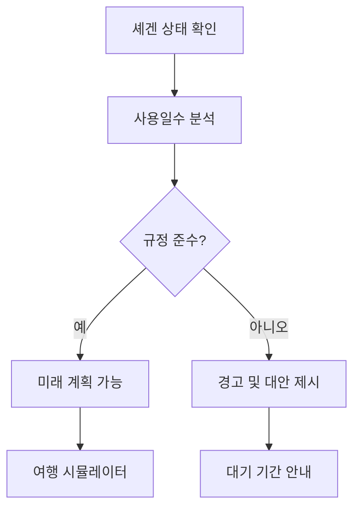

# 셰겐 계산기 (/schengen)

## 개요

셰겐 지역의 90/180일 규칙을 자동으로 계산하고 시각화하는 전문 도구입니다. 복잡한 셰겐 규정을 쉽게 이해하고 준수할 수 있도록 도와줍니다.

### 주요 기능
- 실시간 셰겐 사용일수 계산
- 180일 롤링 윈도우 시각화
- 미래 여행 시뮬레이터
- 규정 준수 상태 확인
- 경고 및 권고사항 제공
- 모바일 최적화 UI

## 사용자 역할 및 플로우

### 1. 신규 사용자 플로우
```mermaid
graph TD
    A[셰겐 계산기 방문] --> B{여행 기록 있음?}
    B -->|아니오| C[여행 추가 안내]
    C --> D[/trips로 이동]
    B -->|예| E[셰겐 분석 표시]
    E --> F[현재 상태 확인]
    F --> G[미래 계획 시뮬레이션]
```

### 2. 기존 사용자 플로우


## UI/UX 요소

### 1. 페이지 구조
```typescript
SchengenPage
├── PageHeader (제목, 설명, 네비게이션)
├── Empty State (여행 기록 없을 때)
├── Stats Cards (현재 상태)
│   ├── 사용일수
│   ├── 남은일수
│   └── 다음 재설정일
├── Compliance Alert (준수/위반 상태)
├── Usage Chart (180일 시각화)
├── Future Trip Simulator
└── Mobile Components (Pull to Refresh)
```

### 2. 통계 카드
**3가지 핵심 지표:**
1. **사용일수**: 최근 180일 중 셰겐 체류일
2. **남은일수**: 90일 중 사용 가능한 일수
3. **다음 재설정**: 가장 오래된 기록이 만료되는 날짜

### 3. 준수 상태 알림
```typescript
// 준수 상태
✅ 셰겐 규정 준수 (초록색 알림)

// 위반 상태
⚠️ 셰겐 규정 위반 (빨간색 알림)
+ 구체적인 경고 메시지
```

### 4. 사용 현황 차트
- **SchengenUsageChart 컴포넌트**
- 180일 롤링 윈도우 시각화
- 일별 체류 상태 표시
- 인터랙티브 툴팁

### 5. 미래 여행 시뮬레이터
**입력 필드:**
- 여행 시작일 (날짜 선택)
- 체류 일수 (1-90일)
- 방문 국가 (셰겐 국가 목록)

**분석 결과:**
- 가능 여부 (✅/❌)
- 예상 사용일수
- 권장사항
- 위험 경고

### 6. 빈 상태 처리
```typescript
// 온보딩 가이드
1. 셰겐 지역 소개
2. 90/180일 규칙 설명
3. 여행 추가 유도
```

## 기술 구현

### 1. 상태 관리
```typescript
const [hasTrips, setHasTrips] = useState<boolean | null>(null)
const [loading, setLoading] = useState(true)
const [trips, setTrips] = useState<CountryVisit[]>([])
const [schengenData, setSchengenData] = useState<any>(null)
const [futureDate, setFutureDate] = useState<string>('')
const [futureDuration, setFutureDuration] = useState<number>(7)
const [futureCountry, setFutureCountry] = useState<string>('France')
const [futureAnalysis, setFutureAnalysis] = useState<any>(null)
const [isMobile, setIsMobile] = useState(false)
```

### 2. API 통합
```typescript
// 병렬 데이터 로딩
const [tripsResponse, schengenResponse] = await Promise.all([
  ApiClient.getTrips(),
  ApiClient.getSchengenStatus()
])
```

### 3. 셰겐 계산 로직
```typescript
// 180일 롤링 윈도우
const windowStart = new Date(startDate)
windowStart.setDate(windowStart.getDate() - 180)

// 사용일수 계산
// 각 여행의 겹치는 기간 계산
// 90일 규칙 검증
```

### 4. 모바일 최적화
```typescript
// Pull to Refresh
<PullToRefresh onRefresh={loadSchengenData}>
  {content}
</PullToRefresh>

// Swipeable Cards (모바일)
<SwipeableCard>
  {statsContent}
</SwipeableCard>
```

## 성능 지표

### 1. 계산 최적화
- 메모이제이션으로 재계산 최소화
- 날짜 연산 최적화
- 차트 렌더링 최적화

### 2. 데이터 로딩
- 병렬 API 호출
- 로딩 상태 세분화
- 에러 바운더리

### 3. 렌더링 최적화
- 조건부 렌더링
- 컴포넌트 분할
- 불필요한 리렌더링 방지

## 모바일 지원

### 1. 터치 제스처
- Pull to Refresh 지원
- 스와이프 가능한 카드
- 터치 친화적 입력

### 2. 반응형 레이아웃
- 모바일: 세로 스택
- 태블릿: 2열 그리드
- 데스크톱: 3열 입력

### 3. 성능 고려사항
- 차트 간소화
- 애니메이션 최소화
- 터치 이벤트 최적화

## 알려진 이슈

### 1. 셰겐 국가 하드코딩
- 문제: 국가 목록이 컴포넌트에 하드코딩
- 해결: 중앙 관리 필요

### 2. 타입 안정성
- 문제: schengenData가 any 타입
- 해결: 명확한 타입 정의 필요

### 3. 날짜 계산 복잡도
- 문제: 복잡한 날짜 연산 로직
- 해결: 유틸리티 함수로 추출

## 개선 계획

### 단기 (1-2주)
1. 셰겐 국가 데이터 중앙화
2. TypeScript 타입 강화
3. 날짜 계산 유틸리티 분리
4. 차트 인터랙션 개선

### 중기 (1개월)
1. 비자 유형별 계산 지원
2. 여행 계획 저장 기능
3. PDF 리포트 생성
4. 다중 시나리오 비교

### 장기 (3개월)
1. AI 기반 여행 추천
2. 실시간 규정 업데이트
3. 다른 비자 규칙 지원
4. 캘린더 통합

## SEO/메타데이터

### 메타 태그
```html
<title>셰겐 계산기 - DINO | 90/180일 규칙 자동 계산</title>
<meta name="description" content="셰겐 지역 90/180일 규칙을 자동으로 계산하고 비자 준수 상태를 확인하세요. 미래 여행 시뮬레이터 포함.">
<meta name="keywords" content="셰겐계산기, 90/180규칙, 유럽비자, 셰겐비자, schengen calculator">
```

## 보안 고려사항

### 1. 인증 확인
- 페이지 접근 시 세션 확인
- 미인증 사용자 리다이렉트

### 2. 데이터 보안
- 사용자별 데이터 격리
- 민감 정보 클라이언트 노출 방지

### 3. 입력 검증
- 날짜 범위 검증
- 숫자 입력 범위 제한

## 사용자 분석

### 추적 이벤트
1. 페이지 방문
2. 시뮬레이터 사용
3. 차트 인터랙션
4. 여행 추가 클릭
5. 경고 표시 빈도

### 주요 지표
- 평균 셰겐 사용률
- 시뮬레이터 사용률
- 규정 위반 비율
- 기능별 사용 시간

## 셰겐 규칙 설명

### 90/180일 규칙
- **기본 원칙**: 연속된 180일 중 최대 90일 체류 가능
- **롤링 윈도우**: 매일 180일 기간이 재계산됨
- **누적 계산**: 여러 번 입출국 시 모든 일수 합산

### 셰겐 지역 국가 (26개국)
```
오스트리아, 벨기에, 체코, 덴마크, 에스토니아, 핀란드,
프랑스, 독일, 그리스, 헝가리, 아이슬란드, 이탈리아,
라트비아, 리투아니아, 룩셈부르크, 몰타, 네덜란드,
노르웨이, 폴란드, 포르투갈, 슬로바키아, 슬로베니아,
스페인, 스웨덴, 스위스, 리히텐슈타인
```

## 관련 컴포넌트

- `components/schengen/SchengenUsageChart.tsx` - 사용 현황 차트
- `components/mobile/PullToRefresh.tsx` - 당겨서 새로고침
- `components/mobile/SwipeableCard.tsx` - 스와이프 카드
- `lib/api-client.ts` - API 통신
- `lib/schengen/calculator.ts` - 계산 로직 (TODO)

## 관련 문서

- [여행 기록](./trips.md) - 여행 데이터 관리
- [대시보드](./dashboard.md) - 전체 통계 확인
- [API 문서](./api.md) - 셰겐 API 엔드포인트
- [비즈니스 로직](../BUSINESS_LOGIC.md) - 셰겐 계산 상세