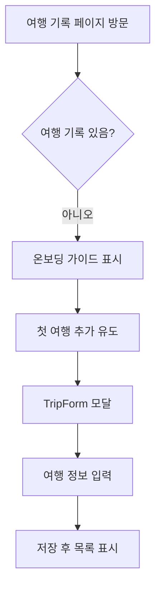
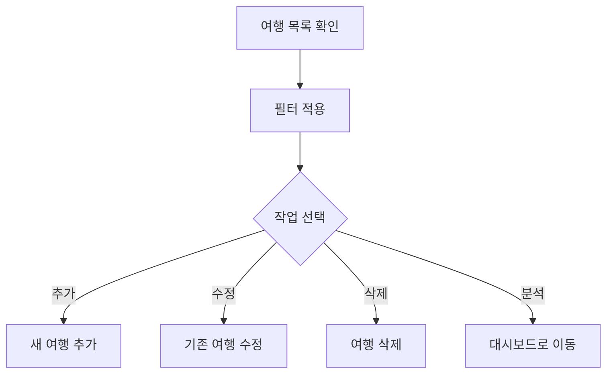

# 여행 기록 (/trips)

## 개요

사용자의 모든 여행 기록을 관리하는 핵심 페이지입니다. 국가별 입출국 정보, 비자 정보, 체류 일수를 기록하고 관리합니다.

### 주요 기능

- 여행 기록 추가/수정/삭제 (CRUD)
- 셰겐 지역 필터링
- 현재 체류 중인 국가 표시
- 체류 일수 자동 계산
- 모바일 최적화 UI
- 초보자를 위한 가이드 제공

## 사용자 역할 및 플로우

### 1. 신규 사용자 플로우



### 2. 기존 사용자 플로우



## UI/UX 요소

### 1. 페이지 헤더

- **PageHeader 컴포넌트** 사용
- 제목: "여행 기록"
- 설명: "여행 정보를 기록하고 비자 상태를 추적하세요"
- 빵 부스러기: 대시보드 > 여행 기록
- 도움말 버튼 (기록이 있을 때만)
- 추가 버튼 (항상 표시)

### 2. 필터 탭

```typescript
// 3가지 필터 옵션
- 전체: 모든 여행 기록
- 셰겐: 셰겐 지역 국가만
- 현재 체류 중: exitDate가 없는 기록
```

### 3. 빈 상태 처리

**3단계 온보딩 가이드:**

1. 간편한 기록
2. 자동 분석
3. 스마트 알림

**FAQ 섹션:**

- 과거 여행 기록 필요성
- 연속 여행 기록 방법
- 현재 체류 표시 방법

**프로 팁:**

- Gmail 연동 유도
- 자동화 이점 설명

### 4. 여행 카드

**데스크톱 (TripCard):**

- 그리드 레이아웃 (3열)
- 카드 형식 표시
- 호버 효과

**모바일 (MobileTripCard):**

- 단일 열 레이아웃
- 스와이프 액션 지원
- 터치 최적화

### 5. 여행 폼 모달

**데스크톱:**

- 중앙 정렬 모달
- 오버레이 배경

**모바일 (MobileModal):**

- 전체 화면 모달
- 하단 슬라이드 애니메이션
- 터치 제스처 지원

## 기술 구현

### 1. 컴포넌트 구조

```typescript
TripsPage (Client Component)
├── PageHeader
├── Filter Tabs
├── Content Area
│   ├── Empty State (온보딩 가이드)
│   └── Trip Grid
│       ├── TripCard (Desktop)
│       └── MobileTripCard (Mobile)
└── Form Modal
    ├── TripForm (Lazy loaded)
    └── MobileModal (Mobile wrapper)
```

### 2. 상태 관리

```typescript
// 주요 상태
const [trips, setTrips] = useState<CountryVisit[]>([]);
const [loading, setLoading] = useState(true);
const [showForm, setShowForm] = useState(false);
const [editingTrip, setEditingTrip] = useState<CountryVisit | null>(null);
const [filter, setFilter] = useState<'all' | 'schengen' | 'current'>('all');
const [showHelp, setShowHelp] = useState(false);
const [isMobile, setIsMobile] = useState(false);
```

### 3. API 통합

```typescript
// ApiClient 사용
- getTrips(): 여행 목록 조회
- deleteTrip(id): 여행 삭제
- createTrip(): TripForm 내부에서 처리
- updateTrip(): TripForm 내부에서 처리
```

### 4. 코드 분할 최적화

```typescript
// Dynamic imports for better performance
const TripForm = lazy(() => import('@/components/trips/TripForm'));
const TripCard = lazy(() => import('@/components/trips/TripCard'));
const MobileTripCard = lazy(() => import('@/components/trips/MobileTripCard'));
```

### 5. 반응형 처리

```typescript
// 모바일 감지 및 대응
useEffect(() => {
  const checkMobile = () => {
    setIsMobile(window.innerWidth < 768);
  };
  checkMobile();
  window.addEventListener('resize', checkMobile);
  return () => window.removeEventListener('resize', checkMobile);
}, []);
```

## 성능 지표

### 1. 로딩 최적화

- Lazy loading으로 초기 번들 크기 감소
- Suspense로 로딩 상태 처리
- 컴포넌트별 코드 분할

### 2. 렌더링 최적화

- 필터 변경 시 메모이제이션
- 카드 컴포넌트 key 최적화
- 불필요한 리렌더링 방지

### 3. 네트워크 최적화

- API 호출 최소화
- 삭제 후 전체 새로고침 대신 로컬 상태 업데이트 고려

## 모바일 지원

### 1. 터치 최적화

- 스와이프 액션 (MobileTripCard)
- 터치 타겟 크기 최적화 (최소 44px)
- 하단 시트 스타일 모달

### 2. 레이아웃 조정

- 단일 열 레이아웃
- 전체 화면 모달
- 간소화된 필터 UI

### 3. 성능 고려사항

- 모바일에서 더 적은 카드 렌더링
- 이미지 최적화
- 애니메이션 간소화

## 알려진 이슈

### 1. 셰겐 국가 하드코딩

- 문제: 셰겐 국가 목록이 여러 곳에 중복
- 해결: 상수로 추출하여 중앙 관리 필요

### 2. 삭제 후 전체 새로고침

- 문제: 네트워크 요청 중복
- 해결: 로컬 상태 업데이트로 최적화 가능

### 3. 필터 카운트 중복 계산

- 문제: 필터 버튼에서 매번 재계산
- 해결: useMemo로 메모이제이션 필요

## 개선 계획

### 단기 (1-2주)

1. 셰겐 국가 목록 중앙화
2. 필터 성능 최적화
3. 삭제 UX 개선 (Optimistic UI)
4. 로딩 스켈레톤 추가

### 중기 (1개월)

1. 여행 정렬 옵션 추가
2. 벌크 작업 지원 (다중 선택)
3. 여행 검색 기능
4. 데이터 내보내기/가져오기

### 장기 (3개월)

1. 여행 타임라인 뷰
2. 지도 뷰 통합
3. 여행 통계 대시보드
4. 소셜 공유 기능

## SEO/메타데이터

### 메타 태그

```html
<title>여행 기록 - DINO | 비자 추적 및 여행 관리</title>
<meta
  name="description"
  content="여행 기록을 체계적으로 관리하고 비자 상태를 실시간으로 추적하세요. 셰겐 90/180일 규칙 자동 계산."
/>
```

## 보안 고려사항

### 1. 인증 확인

- 페이지 로드 시 세션 확인
- 미인증 사용자 로그인 페이지로 리다이렉트

### 2. 데이터 접근 제어

- 사용자별 여행 데이터 격리
- API 레벨에서 권한 확인

### 3. 입력 검증

- TripForm에서 클라이언트 검증
- 서버 측 추가 검증 필요

## 사용자 분석

### 추적 이벤트

1. 페이지 방문
2. 여행 추가/수정/삭제
3. 필터 사용
4. Gmail 연동 클릭
5. 도움말 토글

### 주요 지표

- 평균 여행 기록 수
- 필터 사용률
- 폼 완성률
- 모바일 vs 데스크톱 사용 비율

## 관련 컴포넌트

- `components/trips/TripForm.tsx` - 여행 정보 입력 폼
- `components/trips/TripCard.tsx` - 데스크톱 여행 카드
- `components/trips/MobileTripCard.tsx` - 모바일 여행 카드
- `components/mobile/MobileModal.tsx` - 모바일 모달
- `lib/api-client.ts` - API 통신 레이어

## 관련 문서

- [대시보드](./dashboard.md) - 여행 통계 확인
- [셰겐 계산기](./schengen.md) - 셰겐 규칙 상세 분석
- [설정](./settings.md) - Gmail 연동 설정
- [API 문서](./api.md) - 여행 API 엔드포인트
