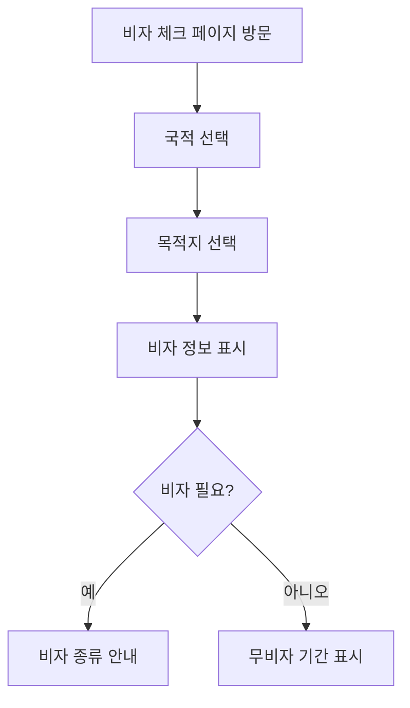
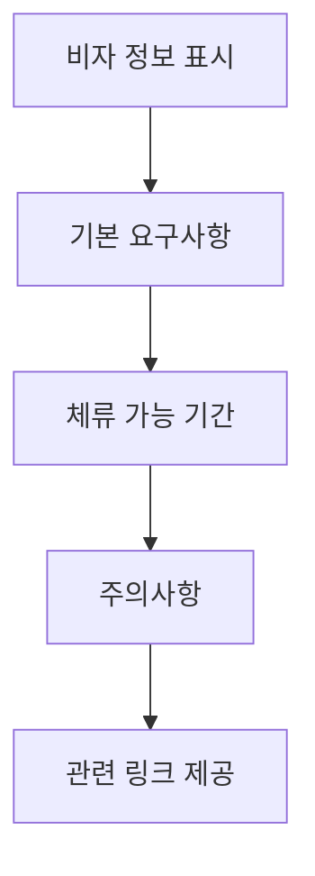

# 비자 빠른 체크 (/visa-check)

## 개요

여행하고자 하는 국가의 비자 요구사항을 빠르게 확인할 수 있는 간편한 도구입니다. 사용자의 국적과 목적지를 선택하면 즉시 비자 필요 여부를 확인할 수 있습니다.

### 주요 기능

- 국가별 비자 요구사항 즉시 확인
- 무비자 입국 가능 기간 표시
- 비자 종류 및 요구사항 안내
- 모바일 최적화 인터페이스
- 관련 기능으로 빠른 이동

## 사용자 역할 및 플로우

### 1. 사용자 플로우



### 2. 정보 제공 플로우



## UI/UX 요소

### 1. 페이지 구조

```typescript
VisaCheckPage
├── Header
│   ├── 페이지 제목 (아이콘 포함)
│   └── 대시보드 링크
├── 설명 텍스트
├── QuickVisaCheck 컴포넌트
├── 안내 사항 박스
│   ├── 비자 정보 안내
│   └── 주의사항 목록
└── 유용한 링크 (2개)
    ├── 여행 일정 관리
    └── 셰겐 계산기
```

### 2. QuickVisaCheck 컴포넌트

- **국적 선택**: 드롭다운 또는 검색
- **목적지 선택**: 국가 목록 또는 지도
- **결과 표시**: 비자 요구사항 카드
- **추가 정보**: 상세 요구사항 토글

### 3. 안내 사항

```typescript
// 표시되는 안내 사항
- 일반적인 관광 비자 기준
- 대사관/영사관 확인 권고
- 비자 정책 변경 가능성
- 장기 체류/업무 목적 별도 비자
```

### 4. 유용한 링크 카드

- **여행 일정 관리**: 비자 만료일 추적
- **셰겐 계산기**: 유럽 체류일수 계산

## 기술 구현

### 1. 컴포넌트 구조

```typescript
// 메인 페이지 컴포넌트
export default function VisaCheckPage() {
  return (
    <main>
      <Header />
      <QuickVisaCheck />
      <InfoSection />
      <UsefulLinks />
    </main>
  )
}
```

### 2. QuickVisaCheck 컴포넌트 (별도)

- 국가 데이터베이스 연동
- 비자 규정 매트릭스
- 실시간 결과 계산
- 상태 관리

### 3. 스타일링

- Tailwind CSS 클래스
- 다크 모드 지원
- 반응형 그리드
- 호버 효과

## 성능 지표

### 1. 로딩 최적화

- QuickVisaCheck 컴포넌트 lazy loading
- 국가 데이터 캐싱
- 최소한의 초기 렌더링

### 2. 사용자 경험

- 즉각적인 결과 표시
- 부드러운 전환 효과
- 명확한 시각적 피드백

## 모바일 지원

### 1. 반응형 디자인

- 모바일: 단일 열 레이아웃
- 태블릿/데스크톱: 2열 그리드
- 터치 친화적 UI

### 2. 모바일 최적화

- 큰 터치 타겟
- 스크롤 최소화
- 간소화된 인터페이스

## 알려진 이슈

### 1. 비자 정보 업데이트

- 문제: 수동 업데이트 필요
- 영향: 최신 정보 반영 지연
- 해결: 자동 업데이트 시스템 구축

### 2. 국가 데이터 완성도

- 문제: 일부 국가 정보 부족
- 해결: 지속적인 데이터 보완

### 3. 복잡한 비자 규정

- 문제: 특수 상황 처리 미흡
- 해결: 상세 조건 시스템 구현

## 개선 계획

### 단기 (1-2주)

1. 더 많은 국가 데이터 추가
2. 비자 종류별 상세 정보
3. 최근 검색 기록
4. 즐겨찾기 기능

### 중기 (1개월)

1. 비자 정보 자동 업데이트
2. 대사관 연락처 통합
3. 비자 신청 가이드
4. 다국어 지원

### 장기 (3개월)

1. AI 기반 비자 추천
2. 실시간 정책 변경 알림
3. 비자 신청 서비스 연동
4. 커뮤니티 정보 공유

## SEO/메타데이터

### 메타 태그

```html
<title>비자 빠른 체크 - DINO | 국가별 비자 요구사항 확인</title>
<meta
  name="description"
  content="여행 목적지의 비자 요구사항을 빠르게 확인하세요. 무비자 입국 가능 기간과 비자 종류를 한눈에 확인할 수 있습니다."
/>
<meta
  name="keywords"
  content="비자체크, 비자확인, 무비자입국, 비자요구사항, visa check"
/>
```

## 보안 고려사항

### 1. 데이터 정확성

- 공식 소스 데이터 사용
- 정기적인 검증
- 면책 조항 표시

### 2. 사용자 데이터

- 검색 기록 암호화
- 개인정보 미수집
- 쿠키 최소화

## 사용자 분석

### 추적 이벤트

1. 페이지 방문
2. 국가 선택
3. 결과 조회
4. 관련 링크 클릭
5. 정보 정확도 피드백

### 주요 지표

- 인기 검색 경로
- 평균 체류 시간
- 전환율 (여행 일정 등록)
- 사용자 만족도

## 비자 정보 시스템

### 데이터 구조

```typescript
interface VisaRequirement {
  fromCountry: string;
  toCountry: string;
  visaRequired: boolean;
  visaFreedays?: number;
  visaTypes?: VisaType[];
  lastUpdated: Date;
  source: string;
}

interface VisaType {
  type: 'tourist' | 'business' | 'transit' | 'other';
  duration: number;
  requirements: string[];
  fee: number;
  processingTime: string;
}
```

### 정보 소스

- 각국 대사관 공식 정보
- IATA 비자 데이터베이스
- 정부 공식 발표
- 커뮤니티 업데이트

## 관련 컴포넌트

- `components/visa/QuickVisaCheck.tsx` - 핵심 비자 체크 컴포넌트
- `lib/visa-data.ts` - 비자 정보 데이터베이스
- `lib/countries.ts` - 국가 목록 및 코드

## 관련 문서

- [여행 기록](./trips.md) - 비자 만료일 관리
- [셰겐 계산기](./schengen.md) - 유럽 체류 계산
- [대시보드](./dashboard.md) - 전체 여행 관리
- [프로필](./profile.md) - 국적 정보 설정
