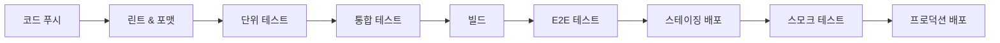

# 🧪 테스팅 & QA

## 🎯 개요

**완벽한 품질의 소프트웨어**를 만들기 위한 체계적인 테스팅 전략과 QA 프로세스를 제시합니다.

### 테스팅의 중요성
- 🛡️ **버그 예방**: 배포 전 문제 발견
- 💰 **비용 절약**: 조기 발견이 비용 효율적
- 🚀 **빠른 배포**: 자신감 있는 릴리스
- 📈 **품질 향상**: 지속적인 품질 개선

## 📚 테스팅 철학

### 핵심 원칙
- **테스트 주도 개발(TDD)**: 구현 전 테스트 작성
- **시프트 레프트**: 조기 테스트 및 지속적 테스트
- **위험 기반 테스트**: 비즈니스 영향도 기반 우선순위
- **자동화 우선**: 반복적 테스트 자동화
- **사용자 중심**: 실제 사용자 시나리오 집중

## 테스트 피라미드

```
         /\
        /E2E\        (5-10%)
       /------\
      /  API   \     (20-30%)
     /----------\
    / Integration \  (30-40%)
   /--------------\
  /   Unit Tests   \ (40-50%)
 /------------------\
```

## 🎯 테스트 유형 및 커버리지

### 1. 단위 테스트 (Unit Tests)
**커버리지 목표**: 80% 이상

#### 프론트엔드 컴포넌트
```typescript
// 예시: 여행 컴포넌트 테스트
describe('TripCard', () => {
  it('여행 정보를 올바르게 표시해야 함', () => {
    const trip = mockTrip();
    render(<TripCard trip={trip} />);
    expect(screen.getByText(trip.country)).toBeInTheDocument();
  });
});
```

#### 비즈니스 로직
```typescript
// 예시: 솅겐 계산기 테스트
describe('SchengenCalculator', () => {
  it('일수를 정확히 계산해야 함', () => {
    const stays = [
      { startDate: '2024-01-01', endDate: '2024-01-10' }
    ];
    expect(calculateDays(stays)).toBe(10);
  });
});
```

### 2. 통합 테스트 (Integration Tests)
**커버리지 목표**: 70% 이상

#### API 통합
```typescript
// 예시: API 라우트 테스트
describe('POST /api/trips', () => {
  it('새로운 여행을 생성해야 함', async () => {
    const response = await request(app)
      .post('/api/trips')
      .send(validTripData)
      .expect(201);
    
    expect(response.body).toHaveProperty('id');
  });
});
```

#### 데이터베이스 통합
```typescript
// 예시: Prisma 통합 테스트
describe('TripRepository', () => {
  it('여행 데이터를 저장해야 함', async () => {
    const trip = await createTrip(tripData);
    const found = await findTripById(trip.id);
    expect(found).toEqual(trip);
  });
});
```

### 3. 종단간 테스트 (E2E Tests)
**커버리지 목표**: 핵심 사용자 여정

#### 사용자 워크플로우
```typescript
// 예시: Playwright E2E 테스트
test('사용자가 여행을 추가하고 조회할 수 있음', async ({ page }) => {
  await page.goto('/dashboard');
  await page.click('text=여행 추가');
  await page.fill('[name=country]', '프랑스');
  await page.fill('[name=startDate]', '2024-01-01');
  await page.fill('[name=endDate]', '2024-01-05');
  await page.click('text=저장');
  
  await expect(page.locator('text=프랑스')).toBeVisible();
});
```

### 4. 성능 테스트 (Performance Tests)
**목표 지표**:
- 페이지 로드: < 3초
- API 응답: < 200ms
- 상호작용 시간: < 5초

```typescript
// 예시: 성능 테스트
test('대시보드가 성능 예산 내에서 로드됨', async ({ page }) => {
  const metrics = await page.evaluate(() => ({
    lcp: performance.getEntriesByType('largest-contentful-paint')[0],
    fcp: performance.getEntriesByName('first-contentful-paint')[0]
  }));
  
  expect(metrics.lcp.startTime).toBeLessThan(2500);
});
```

### 5. 보안 테스트 (Security Tests)
**주요 영역**:
- 인증/인가
- 입력 검증
- SQL 인젝션 방지
- XSS 보호

```typescript
// 예시: 보안 테스트
describe('보안', () => {
  it('SQL 인젝션을 방지해야 함', async () => {
    const maliciousInput = "'; DROP TABLE users; --";
    const response = await request(app)
      .post('/api/trips')
      .send({ country: maliciousInput })
      .expect(400);
  });
});
```

### 6. 접근성 테스트 (Accessibility Tests)
**WCAG 2.1 AA 준수**

```typescript
// 예시: 접근성 테스트
test('대시보드가 접근 가능함', async ({ page }) => {
  await page.goto('/dashboard');
  const violations = await checkA11y(page);
  expect(violations).toHaveLength(0);
});
```

## 🛠️ 테스트 인프라

### 테스트 환경 설정
```yaml
# test-config.yml
environments:
  unit:
    framework: Jest
    coverage: 80%
    parallel: true
  
  integration:
    framework: Jest + Supertest
    database: SQLite (in-memory)
    mocks: enabled
  
  e2e:
    framework: Playwright
    browsers: [chromium, firefox, webkit]
    viewport: [desktop, mobile]
```

### CI/CD 통합
```yaml
# .github/workflows/test.yml
name: 테스트 스위트
on: [push, pull_request]

jobs:
  test:
    runs-on: ubuntu-latest
    steps:
      - uses: actions/checkout@v3
      - name: 단위 테스트 실행
        run: npm run test:unit
      - name: 통합 테스트 실행
        run: npm run test:integration
      - name: E2E 테스트 실행
        run: npm run test:e2e
      - name: 커버리지 업로드
        uses: codecov/codecov-action@v3
```

## 📊 테스트 데이터 관리

### 테스트 데이터 전략
```typescript
// 테스트 데이터 팩토리
export const createMockUser = (overrides = {}) => ({
  id: faker.string.uuid(),
  email: faker.internet.email(),
  name: faker.person.fullName(),
  ...overrides
});

export const createMockTrip = (overrides = {}) => ({
  id: faker.string.uuid(),
  country: faker.location.country(),
  startDate: faker.date.future(),
  endDate: faker.date.future(),
  ...overrides
});
```

### 데이터베이스 시딩
```typescript
// seed.ts
async function seed() {
  // 기존 데이터 정리
  await prisma.trip.deleteMany();
  await prisma.user.deleteMany();
  
  // 테스트 사용자 생성
  const users = await Promise.all(
    Array(5).fill(null).map(() => 
      prisma.user.create({ data: createMockUser() })
    )
  );
  
  // 테스트 여행 생성
  for (const user of users) {
    await Promise.all(
      Array(10).fill(null).map(() =>
        prisma.trip.create({
          data: { ...createMockTrip(), userId: user.id }
        })
      )
    );
  }
}
```

## 🚦 품질 게이트

### 커밋 전 검사
```json
// .husky/pre-commit
{
  "hooks": {
    "pre-commit": [
      "npm run lint",
      "npm run type-check",
      "npm run test:unit"
    ]
  }
}
```

### PR 승인 기준
- [ ] 모든 테스트 통과
- [ ] 코드 커버리지 ≥ 80%
- [ ] 보안 취약점 없음
- [ ] 성능 예산 준수
- [ ] 접근성 검사 통과

### 완료 정의 (Definition of Done)
- [ ] 기능 구현 완료
- [ ] 단위 테스트 작성
- [ ] 통합 테스트 추가
- [ ] 핵심 경로 E2E 테스트
- [ ] 문서 업데이트
- [ ] 코드 리뷰 완료
- [ ] QA 승인

## 🚀 테스트 실행 전략

### 로컬 개발
```bash
# 모든 테스트 실행
npm test

# 특정 테스트 유형 실행
npm run test:unit
npm run test:integration
npm run test:e2e

# 커버리지와 함께 실행
npm run test:coverage

# 워치 모드로 실행
npm run test:watch
```

### 지속적 통합


## 🐛 버그 관리

### 버그 리포트 템플릿
```markdown
## 버그 설명
문제에 대한 간단한 설명

## 재현 단계
1. '...'로 이동
2. '...' 클릭
3. 오류 확인

## 예상 동작
어떻게 동작해야 하는지

## 실제 동작
실제로 어떻게 동작하는지

## 환경
- 브라우저:
- OS:
- 버전:

## 스크린샷/로그
관련 증거 첨부
```

### 버그 심각도 수준
- **치명적**: 시스템 다운, 데이터 손실
- **높음**: 주요 기능 중단
- **보통**: 기능 부분 작동
- **낮음**: 사소한 UI 문제

## ⚡ 성능 테스팅

### 부하 테스트
```javascript
// k6 부하 테스트 예시
import http from 'k6/http';
import { check } from 'k6';

export const options = {
  vus: 100,
  duration: '30s',
  thresholds: {
    http_req_duration: ['p(95)<500']
  }
};

export default function() {
  const res = http.get('https://app.example.com/api/trips');
  check(res, {
    '상태가 200임': (r) => r.status === 200,
    '응답 시간이 500ms 미만': (r) => r.timings.duration < 500
  });
}
```

## 📈 모니터링 & 관찰가능성

### 오류 추적
```typescript
// Sentry 통합
Sentry.init({
  dsn: process.env.SENTRY_DSN,
  environment: process.env.NODE_ENV,
  integrations: [
    new Sentry.BrowserTracing(),
    new Sentry.Replay()
  ],
  tracesSampleRate: 0.1,
  replaysSessionSampleRate: 0.1
});
```

### 성능 모니터링
```typescript
// Web Vitals 추적
import { getCLS, getFID, getFCP, getLCP, getTTFB } from 'web-vitals';

function sendToAnalytics(metric) {
  // 분석 엔드포인트로 전송
  fetch('/api/analytics', {
    method: 'POST',
    body: JSON.stringify(metric),
    headers: { 'Content-Type': 'application/json' }
  });
}

getCLS(sendToAnalytics);
getFID(sendToAnalytics);
getFCP(sendToAnalytics);
getLCP(sendToAnalytics);
getTTFB(sendToAnalytics);
```

## 💡 모범 사례

### 테스트 작성 가이드라인
1. **준비-실행-검증**: 테스트를 명확하게 구조화
2. **테스트당 하나의 단언**: 테스트를 집중적으로 유지
3. **설명적 이름**: 테스트 이름이 무엇을 테스트하는지 설명
4. **DRY**: 테스트 유틸리티와 헬퍼 사용
5. **빠른 테스트**: 외부 의존성을 모킹
6. **격리된 테스트**: 다른 테스트에 의존하지 않음

### 코드 커버리지 가이드라인
- **단위 테스트**: 80% 이상 커버리지
- **핵심 비즈니스 로직**: 95% 이상 커버리지
- **UI 컴포넌트**: 70% 이상 커버리지
- **유틸리티**: 90% 이상 커버리지

### 테스트 유지보수
- 분기별로 테스트 검토 및 업데이트
- 불필요한 테스트 제거
- 프로덕션 코드와 함께 테스트 코드 리팩터링
- 테스트 데이터를 현실적이고 최신 상태로 유지

## 🔧 도구 및 리소스

### 테스팅 도구
- **단위 테스트**: Jest, React Testing Library
- **통합 테스트**: Supertest, MSW
- **E2E 테스트**: Playwright, Cypress
- **성능**: Lighthouse, WebPageTest
- **접근성**: axe-core, Pa11y
- **보안**: OWASP ZAP, Snyk

### 문서화
- [Jest 문서](https://jestjs.io/)
- [Playwright 문서](https://playwright.dev/)
- [Testing Library](https://testing-library.com/)
- [Web Vitals](https://web.dev/vitals/)

## 📊 지속적 개선

### 추적할 지표
- 테스트 실행 시간
- 테스트 불안정성 비율
- 버그 탈출 비율
- 버그 발견 시간
- 테스트 커버리지 추세

### 정기 검토
- 월간 테스트 스위트 상태 점검
- 분기별 전략 검토
- 연간 도구 평가

---

> 🧪 **"품질은 우연이 아니라 의도의 결과다"**

**체계적인 테스팅으로 완벽한 소프트웨어를 만드세요!**