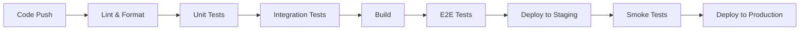

# 🧪 테스팅 & QA

## 🎯 개요

**완벽한 품질의 소프트웨어**를 만들기 위한 체계적인 테스팅 전략과 QA 프로세스를 제시합니다.

### 테스팅의 중요성
- 🛡️ **버그 예방**: 배포 전 문제 발견
- 💰 **비용 절약**: 조기 발견이 비용 효율적
- 🚀 **빠른 배포**: 자신감 있는 릴리스
- 📈 **품질 향상**: 지속적인 품질 개선

## 📚 테스팅 철학

### 핵심 원칙
- **테스트 주도 개발(TDD)**: 구현 전 테스트 작성
- **시프트 레프트**: 조기 테스트 및 지속적 테스트
- **위험 기반 테스트**: 비즈니스 영향도 기반 우선순위
- **자동화 우선**: 반복적 테스트 자동화
- **사용자 중심**: 실제 사용자 시나리오 집중

## 테스트 피라미드

```
         /\
        /E2E\        (5-10%)
       /------\
      /  API   \     (20-30%)
     /----------\
    / Integration \  (30-40%)
   /--------------\
  /   Unit Tests   \ (40-50%)
 /------------------\
```

## Test Types & Coverage

### 1. Unit Tests
**Coverage Target**: 80%+

#### Frontend Components
```typescript
// Example: Trip component test
describe('TripCard', () => {
  it('should display trip details correctly', () => {
    const trip = mockTrip();
    render(<TripCard trip={trip} />);
    expect(screen.getByText(trip.country)).toBeInTheDocument();
  });
});
```

#### Business Logic
```typescript
// Example: Schengen calculation test
describe('SchengenCalculator', () => {
  it('should calculate days correctly', () => {
    const stays = [
      { startDate: '2024-01-01', endDate: '2024-01-10' }
    ];
    expect(calculateDays(stays)).toBe(10);
  });
});
```

### 2. Integration Tests
**Coverage Target**: 70%+

#### API Integration
```typescript
// Example: API route test
describe('POST /api/trips', () => {
  it('should create a new trip', async () => {
    const response = await request(app)
      .post('/api/trips')
      .send(validTripData)
      .expect(201);
    
    expect(response.body).toHaveProperty('id');
  });
});
```

#### Database Integration
```typescript
// Example: Prisma integration test
describe('TripRepository', () => {
  it('should persist trip data', async () => {
    const trip = await createTrip(tripData);
    const found = await findTripById(trip.id);
    expect(found).toEqual(trip);
  });
});
```

### 3. End-to-End Tests
**Coverage Target**: Critical user journeys

#### User Workflows
```typescript
// Example: E2E test with Playwright
test('user can add and view trips', async ({ page }) => {
  await page.goto('/dashboard');
  await page.click('text=Add Trip');
  await page.fill('[name=country]', 'France');
  await page.fill('[name=startDate]', '2024-01-01');
  await page.fill('[name=endDate]', '2024-01-05');
  await page.click('text=Save');
  
  await expect(page.locator('text=France')).toBeVisible();
});
```

### 4. Performance Tests
**Target Metrics**:
- Page Load: < 3s
- API Response: < 200ms
- Time to Interactive: < 5s

```typescript
// Example: Performance test
test('dashboard loads within performance budget', async ({ page }) => {
  const metrics = await page.evaluate(() => ({
    lcp: performance.getEntriesByType('largest-contentful-paint')[0],
    fcp: performance.getEntriesByName('first-contentful-paint')[0]
  }));
  
  expect(metrics.lcp.startTime).toBeLessThan(2500);
});
```

### 5. Security Tests
**Focus Areas**:
- Authentication/Authorization
- Input validation
- SQL injection prevention
- XSS protection

```typescript
// Example: Security test
describe('Security', () => {
  it('should prevent SQL injection', async () => {
    const maliciousInput = "'; DROP TABLE users; --";
    const response = await request(app)
      .post('/api/trips')
      .send({ country: maliciousInput })
      .expect(400);
  });
});
```

### 6. Accessibility Tests
**WCAG 2.1 AA Compliance**

```typescript
// Example: A11y test
test('dashboard is accessible', async ({ page }) => {
  await page.goto('/dashboard');
  const violations = await checkA11y(page);
  expect(violations).toHaveLength(0);
});
```

## Test Infrastructure

### Test Environment Setup
```yaml
# test-config.yml
environments:
  unit:
    framework: Jest
    coverage: 80%
    parallel: true
  
  integration:
    framework: Jest + Supertest
    database: SQLite (in-memory)
    mocks: enabled
  
  e2e:
    framework: Playwright
    browsers: [chromium, firefox, webkit]
    viewport: [desktop, mobile]
```

### CI/CD Integration
```yaml
# .github/workflows/test.yml
name: Test Suite
on: [push, pull_request]

jobs:
  test:
    runs-on: ubuntu-latest
    steps:
      - uses: actions/checkout@v3
      - name: Run Unit Tests
        run: npm run test:unit
      - name: Run Integration Tests
        run: npm run test:integration
      - name: Run E2E Tests
        run: npm run test:e2e
      - name: Upload Coverage
        uses: codecov/codecov-action@v3
```

## Test Data Management

### Test Data Strategy
```typescript
// Test data factories
export const createMockUser = (overrides = {}) => ({
  id: faker.string.uuid(),
  email: faker.internet.email(),
  name: faker.person.fullName(),
  ...overrides
});

export const createMockTrip = (overrides = {}) => ({
  id: faker.string.uuid(),
  country: faker.location.country(),
  startDate: faker.date.future(),
  endDate: faker.date.future(),
  ...overrides
});
```

### Database Seeding
```typescript
// seed.ts
async function seed() {
  // Clear existing data
  await prisma.trip.deleteMany();
  await prisma.user.deleteMany();
  
  // Create test users
  const users = await Promise.all(
    Array(5).fill(null).map(() => 
      prisma.user.create({ data: createMockUser() })
    )
  );
  
  // Create test trips
  for (const user of users) {
    await Promise.all(
      Array(10).fill(null).map(() =>
        prisma.trip.create({
          data: { ...createMockTrip(), userId: user.id }
        })
      )
    );
  }
}
```

## Quality Gates

### Pre-Commit Checks
```json
// .husky/pre-commit
{
  "hooks": {
    "pre-commit": [
      "npm run lint",
      "npm run type-check",
      "npm run test:unit"
    ]
  }
}
```

### Pull Request Criteria
- [ ] All tests pass
- [ ] Code coverage ≥ 80%
- [ ] No security vulnerabilities
- [ ] Performance budgets met
- [ ] Accessibility checks pass

### Definition of Done
- [ ] Feature implemented
- [ ] Unit tests written
- [ ] Integration tests added
- [ ] E2E tests for critical paths
- [ ] Documentation updated
- [ ] Code reviewed
- [ ] QA approved

## Test Execution Strategy

### Local Development
```bash
# Run all tests
npm test

# Run specific test types
npm run test:unit
npm run test:integration
npm run test:e2e

# Run with coverage
npm run test:coverage

# Run in watch mode
npm run test:watch
```

### Continuous Integration


## Bug Management

### Bug Report Template
```markdown
## Bug Description
Brief description of the issue

## Steps to Reproduce
1. Go to '...'
2. Click on '...'
3. See error

## Expected Behavior
What should happen

## Actual Behavior
What actually happens

## Environment
- Browser:
- OS:
- Version:

## Screenshots/Logs
Attach relevant evidence
```

### Bug Severity Levels
- **Critical**: System down, data loss
- **High**: Major feature broken
- **Medium**: Feature partially working
- **Low**: Minor UI issues

## Performance Testing

### Load Testing
```javascript
// k6 load test example
import http from 'k6/http';
import { check } from 'k6';

export const options = {
  vus: 100,
  duration: '30s',
  thresholds: {
    http_req_duration: ['p(95)<500']
  }
};

export default function() {
  const res = http.get('https://app.example.com/api/trips');
  check(res, {
    'status is 200': (r) => r.status === 200,
    'response time < 500ms': (r) => r.timings.duration < 500
  });
}
```

## Monitoring & Observability

### Error Tracking
```typescript
// Sentry integration
Sentry.init({
  dsn: process.env.SENTRY_DSN,
  environment: process.env.NODE_ENV,
  integrations: [
    new Sentry.BrowserTracing(),
    new Sentry.Replay()
  ],
  tracesSampleRate: 0.1,
  replaysSessionSampleRate: 0.1
});
```

### Performance Monitoring
```typescript
// Web Vitals tracking
import { getCLS, getFID, getFCP, getLCP, getTTFB } from 'web-vitals';

function sendToAnalytics(metric) {
  // Send to analytics endpoint
  fetch('/api/analytics', {
    method: 'POST',
    body: JSON.stringify(metric),
    headers: { 'Content-Type': 'application/json' }
  });
}

getCLS(sendToAnalytics);
getFID(sendToAnalytics);
getFCP(sendToAnalytics);
getLCP(sendToAnalytics);
getTTFB(sendToAnalytics);
```

## Best Practices

### Test Writing Guidelines
1. **Arrange-Act-Assert**: Structure tests clearly
2. **One assertion per test**: Keep tests focused
3. **Descriptive names**: Test names should explain what they test
4. **DRY**: Use test utilities and helpers
5. **Fast tests**: Mock external dependencies
6. **Isolated tests**: No test should depend on another

### Code Coverage Guidelines
- **Unit Tests**: 80%+ coverage
- **Critical Business Logic**: 95%+ coverage
- **UI Components**: 70%+ coverage
- **Utilities**: 90%+ coverage

### Test Maintenance
- Review and update tests quarterly
- Remove obsolete tests
- Refactor test code alongside production code
- Keep test data realistic and up-to-date

## Tools & Resources

### Testing Tools
- **Unit Testing**: Jest, React Testing Library
- **Integration Testing**: Supertest, MSW
- **E2E Testing**: Playwright, Cypress
- **Performance**: Lighthouse, WebPageTest
- **Accessibility**: axe-core, Pa11y
- **Security**: OWASP ZAP, Snyk

### Documentation
- [Jest Documentation](https://jestjs.io/)
- [Playwright Documentation](https://playwright.dev/)
- [Testing Library](https://testing-library.com/)
- [Web Vitals](https://web.dev/vitals/)

## Continuous Improvement

### Metrics to Track
- Test execution time
- Test flakiness rate
- Bug escape rate
- Time to detect bugs
- Test coverage trends

### Regular Reviews
- Monthly test suite health check
- Quarterly strategy review
- Annual tool evaluation

---

*Last Updated: [Current Date]*
*Version: 1.0*